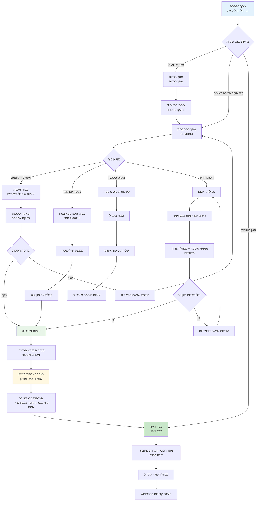
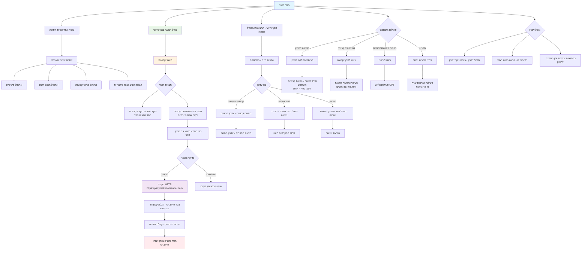
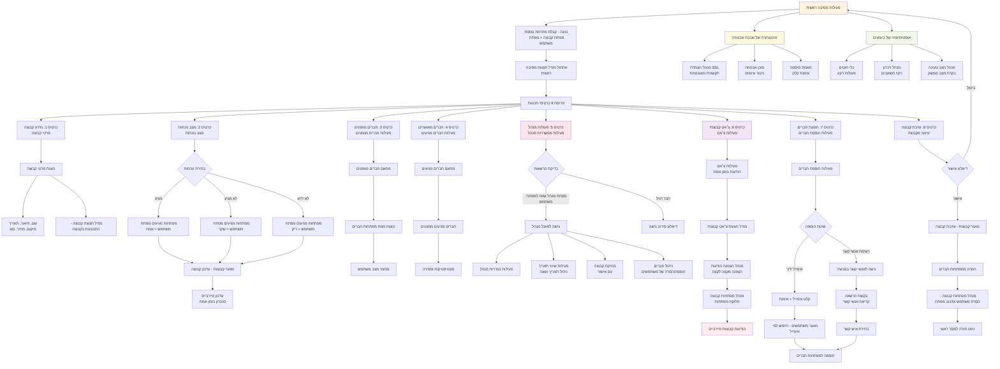
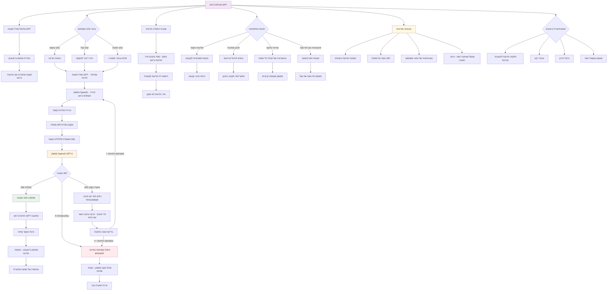
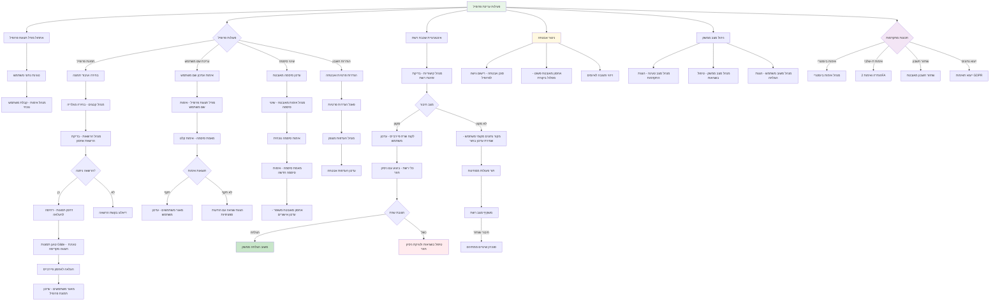
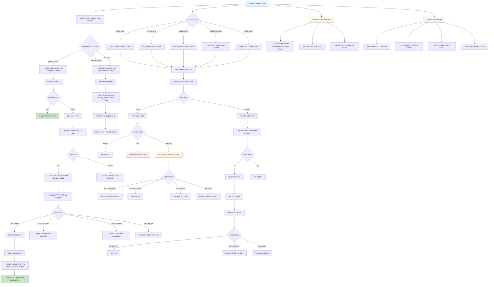

# PartyMaker - דיאגרמות זרימת משתמש מתקדמות
## דיאגרמות זרימה ברמת ארגון - מבוססות על ניתוח ארכיטקטורה מעמיק

---

## 🎯 זרימת אימות וסשן משתמש

---

## 🏠 ארכיטקטורת מסך ראשי וזרימת נתונים

---

## 🎉 פעילות מסיבה ראשית - זרימת ניהול קבוצות מקיפה

---

## 🤖 אינטגרציה מתקדמת של עוזר בינה מלאכותית - זרימת OpenAI ChatGPT

---

## 👤 ניהול פרופיל מתקדם ואינטגרציית אבטחה

---

## ⚙️ ארכיטקטורת מערכת שלמה - תשתית ברמת ארגון

```mermaid
graph TD
    A[לקוח אנדרואיד PartyMaker] --> B[יצירת אפליקציית מסיבה]
    B --> C[שכבת אתחול מערכת]
    
    C --> D[אתחול פיירבייס]
    C --> E[אתחול מנהל רשת]
    C --> F[אתחול מנהל זיכרון]
    C --> G[אתחול מאגרים]
    
    G --> H[קבלת מופע מאגר קבוצות]
    G --> I[קבלת מופע מאגר משתמשים]
    
    H --> J{אסטרטגיית מקור נתונים}
    J --> K[מקור נתונים מקומי קבוצות<br/>מסד נתונים אפליקציה חדר]
    J --> L[מקור נתונים מרוחק קבוצות<br/>לקוח שרת פיירבייס]
    
    I --> M[מקור נתונים מקומי משתמש<br/>DAO משתמש חדר]
    I --> N[מקור נתונים מרוחק משתמש<br/>ממשק משתמשים פיירבייס]
    
    L --> O[כלי רשת - ביצוע עם ניסיון חוזר]
    O --> P{שכבת רשת}
    P -->|ראשי| Q[שרת Spring Boot<br/>partymaker.onrender.com:443]
    P -->|גיבוי| R[שרת פיתוח מקומי<br/>localhost:8080]
    P -->|ישיר| S[גישה ישירה לפיירבייס]
    
    Q --> T[בקר פיירבייס ג׳אווה]
    T --> U[שירות פיירבייס ג׳אווה]
    U --> V[SDK מנהל פיירבייס]
    V --> W[מסד נתונים בזמן אמת פיירבייס]
    
    A --> X{ארכיטקטורת MVVM}
    X --> Y[שכבת הצגה]
    X --> Z[שכבת לוגיקה עסקית]
    X --> AA[שכבת נתונים]
    
    Y --> BB[פעילויות ופרגמנטים]
    BB --> CC[זרימת אימות<br/>התחלה→הכרות→התחברות→רישום]
    BB --> DD[זרימת אפליקציה מרכזית<br/>מסך ראשי→מסיבה ראשית→תכונות]
    BB --> EE[תכונות עזר<br/>פרופיל→הגדרות→אבטחה→בינה מלאכותית]
    
    Z --> FF[מודלי תצוגה]
    FF --> GG[מודל תצוגת מסך ראשי]
    FF --> HH[מודל תצוגת אימות]
    FF --> II[מודל תצוגת קבוצה]
    FF --> JJ[מודל תצוגת פרופיל]
    FF --> KK[מודל תצוגת GPT]
    
    AA --> LL[יישום תבנית מאגר]
    LL --> MM[שכבת הפשטת נתונים]
    MM --> NN[אחסון מקומי<br/>חדר + העדפות משותפות]
    MM --> OO[אחסון מרוחק<br/>פיירבייס + שרת מותאם]
    
    A --> PP{תשתית אבטחה}
    PP --> QQ[שכבת אימות]
    QQ --> RR[מנהל אימות<br/>אימות פיירבייס]
    QQ --> SS[מנהל אימות מאובטח<br/>אבטחה משופרת]
    
    PP --> TT[שכבת הצפנה]
    TT --> UU[מנהל מפתחות קבוצה<br/>הצפנת הודעות מקצה לקצה]
    TT --> VV[מנהל העדפות מוצפן<br/>הצפנת נתונים מקומיים]
    TT --> WW[מנהל הצפנת הודעות<br/>אבטחת צ׳אט]
    
    PP --> XX[אבטחת רשת]
    XX --> YY[מנהל הצמדת SSL<br/>הצמדת אישורים]
    XX --> ZZ[מטפל שגיאות רשת<br/>טיפול מאובטח בשגיאות]
    
    PP --> AAA[ניטור אבטחה]
    AAA --> BBB[סוכן אבטחה<br/>זיהוי איומים]
    AAA --> CCC[מאמת סיסמה<br/>אימות קלט]
    
    A --> DDD{ביצועים ותשתית}
    DDD --> EEE[ניהול זיכרון]
    EEE --> FFF[מנהל זיכרון<br/>ניקוי זיכרון נמוך]
    EEE --> GGG[מנהל מצב טעינה<br/>בקרת מצב ממשק]
    
    DDD --> HHH[חוטים ואסינכרוני]
    HHH --> III[כלי חוטים<br/>פעולות רקע]
    HHH --> JJJ[החלפה ל-AsyncTask<br/>תבנית אסינכרונית מודרנית]
    
    DDD --> KKK[אופטימיזציית רשת]
    KKK --> LLL[מנהל קישוריות<br/>ניטור מצב רשת]
    KKK --> MMM[מנגנוני ניסיון חוזר<br/>עיכוב אקספוננציאלי]
    
    A --> NNN{אינטגרציות חיצוניות}
    NNN --> OOO[שירותי גוגל]
    OOO --> PPP[ממשק כניסה גוגל]
    OOO --> QQQ[ממשק מפות גוגל]
    
    NNN --> RRR[אינטגרציית OpenAI]
    RRR --> SSS[ממשק OpenAI<br/>השלמת צ׳אט GPT-4]
    RRR --> TTT[ניהול הקשר צ׳אט]
    
    NNN --> UUU[אינטגרציית מכשיר]
    UUU --> VVV[מנהל הרשאות<br/>הרשאות זמן ריצה]
    UUU --> WWW[מנהל קבצים<br/>גישה למדיה]
    UUU --> XXX[מנהל התראות<br/>התראות דחיפה]
    
    A --> YYY{תבניות זרימת נתונים}
    YYY --> ZZZ[אסטרטגיה מטמון ראשון]
    ZZZ --> AAAA[בדיקת מטמון מקומי]
    ZZZ --> BBBB[משיכה מרוחקת בהחמצה]
    ZZZ --> CCCC[סנכרון רקע]
    
    YYY --> DDDD[תמיכה לא מקוונת]
    DDDD --> EEEE[תור פעולות ממתינות]
    DDDD --> FFFF[פתרון קונפליקטים]
    DDDD --> GGGG[שחזור מצב רשת]
    
    style A fill:#e1f5fe
    style PP fill:#fff8e1
    style DDD fill:#f1f8e9
    style NNN fill:#f3e5f5
    style YYY fill:#e8f5e8
```

---

## 🔄 סנכרון נתונים מתקדם ופתרון קונפליקטים

---

## 📊 ביצועים מתקדמים וניהול משאבים

```mermaid
graph TD
    A[יצירת אפליקציית מסיבה] --> B[אתחול ביצועי מערכת]
    B --> C[אתחול מנהל זיכרון]
    C --> D[הגדרת מבצעי כלי חוטים]
    D --> E[אתחול מנהל מצב טעינה]
    
    A --> F[שכבת ניהול זיכרון]
    F --> G[קריאות חוזרות רכיב 2 - על חיתוך זיכרון]
    G --> H{רמת לחץ זיכרון}
    H -->|זיכרון קריטי| I[ניקוי זיכרון חירום]
    H -->|זיכרון בינוני| J[ניהול זיכרון פרואקטיבי]
    H -->|זיכרון רקע| K[ניקוי רקע]
    
    I --> L[ניקוי זיכרון Glide]
    I --> M[ניקוי כל הטבלאות חדר]
    I --> N[ניקוי כל הנתונים מודל תצוגה]
    I --> O[כפיית איסוף זבל מערכת]
    
    J --> P[הפחתת מטמון תמונות]
    J --> Q[ניקוי מטמון רשת]
    J --> R[ניקוי אובייקטים לא בשימוש]
    
    K --> S[טיהור נתוני רקע]
    K --> T[ניקוי קבצים ישנים]
    
    A --> U[ארכיטקטורת חוטים]
    U --> V{סיווג סוג פעולה}
    V -->|עדכוני ממשק| W[כלי חוטים - הרצה בחוט ראשי]
    V -->|קלט/פלט רשת| X[מבצע מאגר חוטים רקע]
    V -->|פעולות מסד נתונים| Y[מבצע IO חוט יחיד]
    V -->|עיבוד אינטנסיבי| Z[מאגר עיבוד מקבילי]
    V -->|פעולות קבצים| AA[חוט IO קבצים]
    
    X --> BB[פעולות לקוח שרת פיירבייס]
    BB --> CC[חיבורים מוצמדי SSL]
    CC --> DD[איחוד וחזרה על חיבורים]
    DD --> EE[ניהול פסק זמן בקשות]
    
    Y --> FF[פעולות מסד נתונים חדר]
    FF --> GG[אצוות עסקאות]
    GG --> HH[אופטימיזציית שאילתות SQL]
    HH --> II[ניתוח שימוש באינדקסים]
    
    Z --> JJ[צינור עיבוד תמונות]
    JJ --> KK[דחסן תמונות - דחיסה להעלאה]
    KK --> LL[קידוד JPEG מתקדם]
    LL --> MM[עיבוד רב-חוטי]
    
    A --> NN[אופטימיזציית מחזור חיי פעילות]
    NN --> OO{ניהול מצב מחזור חיים}
    OO -->|ביצירה| PP[הקצאת משאבים מינימלית]
    OO -->|בהתחלה| QQ[קישור שירות]
    OO -->|בהמשכה| RR[רענון נתונים עם זמן המתנה]
    OO -->|בהשהיה| SS[התמדה מצב]
    OO -->|בעצירה| TT[שחרור משאבים]
    OO -->|בהרס| UU[ניקוי מלא]
    
    RR --> VV[בדיקת זמן המתנה לרענון במילי-שניות]
    VV --> WW{זמן המתנה חלף?}
    WW -->|כן| XX[רענון נתונים כפוי]
    WW -->|לא| YY[דילוג על רענון]
    
    SS --> ZZ[שמירת מנהל העדפות מוצפן]
    TT --> AAA[ניקוי חיבור רשת]
    UU --> BBB[ביטול רישום משקיפים]
    BBB --> CCC[מניעת דליפות זיכרון]
    
    A --> DDD[שכבת ביצועי רשת]
    DDD --> EEE[מעקב מצב רשת מנהל קישוריות]
    EEE --> FFF[זיהוי רוחב פס]
    FFF --> GGG[הגדרות איכות מסתגלות]
    
    DDD --> HHH[כלי רשת - ביצוע עם ניסיון חוזר]
    HHH --> III[אסטרטגיית עיכוב אקספוננציאלי]
    III --> JJJ[תבנית מפסק זרם]
    JJJ --> KKK[הסרת כפילות בקשות]
    
    A --> LLL[אופטימיזציית ביצועי ממשק]
    LLL --> MMM[מיחזור בעל תצוגה של תצוגה מחזורית]
    MMM --> NNN[DiffUtil לעדכונים יעילים]
    NNN --> OOO[אופטימיזציית קישור תצוגה]
    
    LLL --> PPP[מנהל מצב טעינה - הצגת טעינה]
    PPP --> QQQ[עיבוד ממשק מתקדם]
    QQQ --> RRR[יישום מסך שלד]
    
    LLL --> SSS[מנהל מצב ממשק - טיפול בשגיאות]
    SSS --> TTT[הודעות שגיאה ידידותיות למשתמש]
    TTT --> UUU[השפלה אלגנטית]
    
    A --> VVV[ניטור ואנליטיקה]
    VVV --> WWW[איסוף מדדי ביצועים]
    WWW --> XXX[מעקב שימוש זיכרון]
    XXX --> YYY[ניטור זמן השהייה רשת]
    YYY --> ZZZ[אנליטיקה של חוויית משתמש]
    
    style A fill:#e1f5fe
    style I fill:#ffebee
    style U fill:#f1f8e9
    style DDD fill:#fff3e0
    style LLL fill:#f3e5f5
    style VVV fill:#e8f5e8
```

---

*דיאגרמות אלו מספקות תמונה מקיפה של כל הזרימות באפליקציית PartyMaker ברמה מקצועית ארגונית*