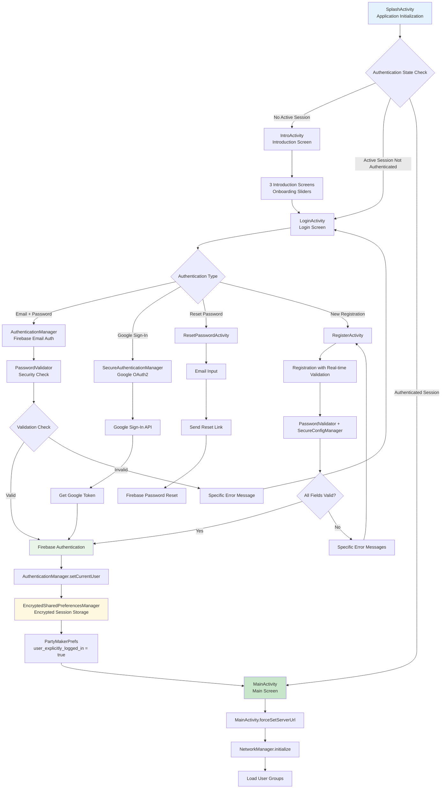
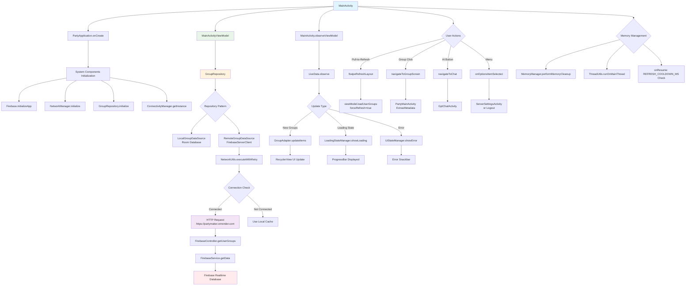
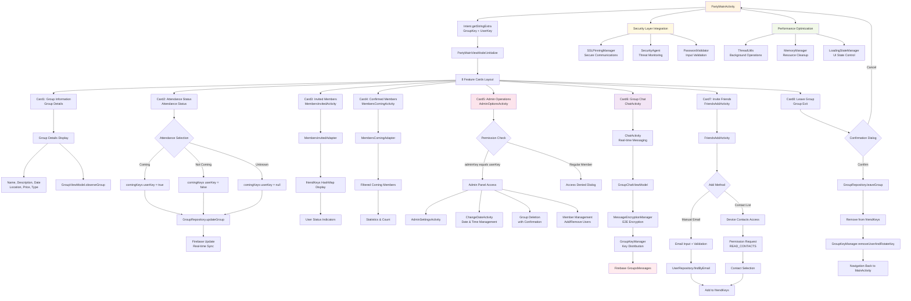
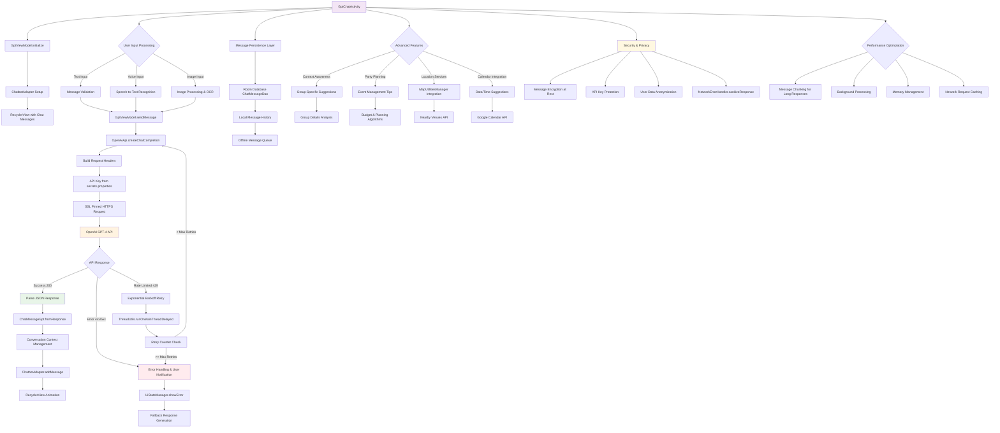
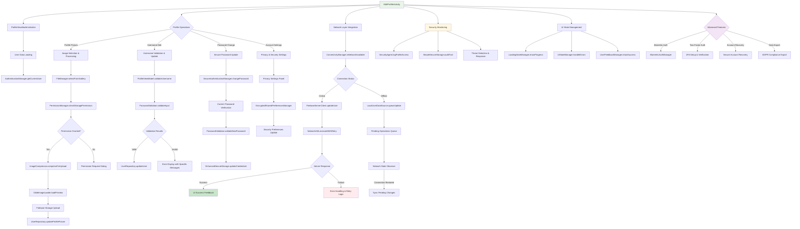
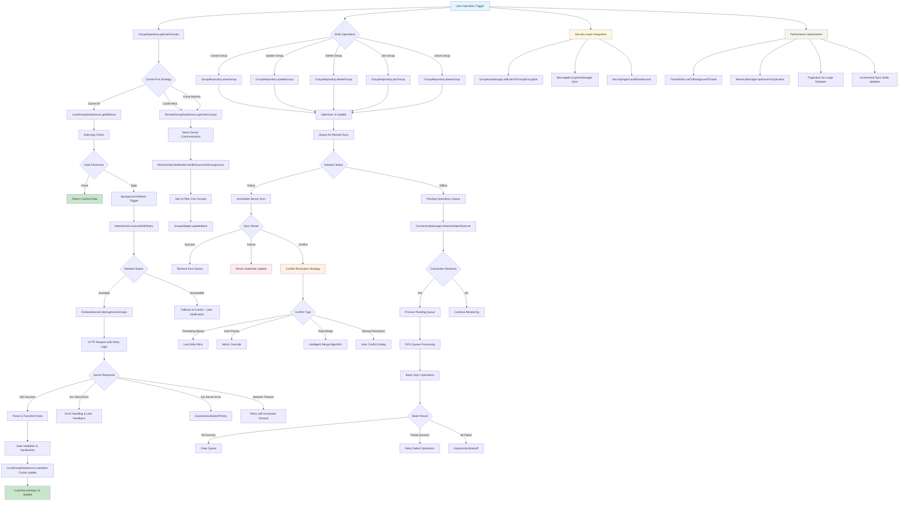

# PartyMaker - Advanced User Flow Diagrams
## Enterprise-Level Flow Diagrams - Based on Deep Architecture Analysis

---

## 🎯 Authentication & User Session Flow

---

## 🏠 MainActivity Architecture & Data Flow

---

## 🎉 PartyMainActivity - Comprehensive Group Management Flow

---

## 🤖 Advanced AI Assistant Integration - OpenAI ChatGPT Flow

---

## 👤 Advanced Profile Management & Security Integration

---

## ⚙️ Complete System Architecture - Enterprise-Level Infrastructure

```mermaid
graph TD
    A[PartyMaker Android Client] --> B[PartyApplication.onCreate]
    B --> C[System Initialization Layer]
    
    C --> D[Firebase.initializeApp]
    C --> E[NetworkManager.initialize]
    C --> F[MemoryManager.initialize]
    C --> G[Repository Initialization]
    
    G --> H[GroupRepository.getInstance]
    G --> I[UserRepository.getInstance]
    
    H --> J{Data Source Strategy}
    J --> K[LocalGroupDataSource<br/>Room AppDatabase]
    J --> L[RemoteGroupDataSource<br/>FirebaseServerClient]
    
    I --> M[LocalUserDataSource<br/>Room UserDao]
    I --> N[RemoteUserDataSource<br/>Firebase Users API]
    
    L --> O[NetworkUtils.executeWithRetry]
    O --> P{Network Layer}
    P -->|Primary| Q[Spring Boot Server<br/>partymaker.onrender.com:443]
    P -->|Fallback| R[Local Dev Server<br/>localhost:8080]
    P -->|Direct| S[Firebase Direct Access]
    
    Q --> T[FirebaseController.java]
    T --> U[FirebaseService.java]
    U --> V[Firebase Admin SDK]
    V --> W[Firebase Realtime Database]
    
    A --> X{MVVM Architecture}
    X --> Y[Presentation Layer]
    X --> Z[Business Logic Layer]
    X --> AA[Data Layer]
    
    Y --> BB[Activities & Fragments]
    BB --> CC[Authentication Flow<br/>Splash→Intro→Login→Register]
    BB --> DD[Core App Flow<br/>MainActivity→PartyMain→Features]
    BB --> EE[Auxiliary Features<br/>Profile→Settings→Security→AI]
    
    Z --> FF[ViewModels]
    FF --> GG[MainActivityViewModel]
    FF --> HH[AuthViewModel]
    FF --> II[GroupViewModel]
    FF --> JJ[ProfileViewModel]
    FF --> KK[GptViewModel]
    
    AA --> LL[Repository Pattern Implementation]
    LL --> MM[Data Abstraction Layer]
    MM --> NN[Local Storage<br/>Room + SharedPreferences]
    MM --> OO[Remote Storage<br/>Firebase + Custom Server]
    
    A --> PP{Security Infrastructure}
    PP --> QQ[Authentication Layer]
    QQ --> RR[AuthenticationManager<br/>Firebase Auth]
    QQ --> SS[SecureAuthenticationManager<br/>Enhanced Security]
    
    PP --> TT[Encryption Layer]
    TT --> UU[GroupKeyManager<br/>E2E Message Encryption]
    TT --> VV[EncryptedSharedPreferencesManager<br/>Local Data Encryption]
    TT --> WW[MessageEncryptionManager<br/>Chat Security]
    
    PP --> XX[Network Security]
    XX --> YY[SSLPinningManager<br/>Certificate Pinning]
    XX --> ZZ[NetworkErrorHandler<br/>Secure Error Handling]
    
    PP --> AAA[Security Monitoring]
    AAA --> BBB[SecurityAgent<br/>Threat Detection]
    AAA --> CCC[PasswordValidator<br/>Input Validation]
    
    A --> DDD{Performance & Infrastructure}
    DDD --> EEE[Memory Management]
    EEE --> FFF[MemoryManager<br/>Low Memory Cleanup]
    EEE --> GGG[LoadingStateManager<br/>UI State Control]
    
    DDD --> HHH[Threading & Async]
    HHH --> III[ThreadUtils<br/>Background Operations]
    HHH --> JJJ[AsyncTaskReplacement<br/>Modern Async Pattern]
    
    DDD --> KKK[Network Optimization]
    KKK --> LLL[ConnectivityManager<br/>Network State Monitoring]
    KKK --> MMM[Retry Mechanisms<br/>Exponential Backoff]
    
    A --> NNN{External Integrations}
    NNN --> OOO[Google Services]
    OOO --> PPP[Google Sign-In API]
    OOO --> QQQ[Google Maps API]
    
    NNN --> RRR[OpenAI Integration]
    RRR --> SSS[OpenAiApi<br/>GPT-4 Chat Completion]
    RRR --> TTT[Chat Context Management]
    
    NNN --> UUU[Device Integration]
    UUU --> VVV[PermissionManager<br/>Runtime Permissions]
    UUU --> WWW[FileManager<br/>Media Access]
    UUU --> XXX[NotificationManager<br/>Push Notifications]
    
    A --> YYY{Data Flow Patterns}
    YYY --> ZZZ[Cache-First Strategy]
    ZZZ --> AAAA[Local Cache Check]
    ZZZ --> BBBB[Remote Fetch on Miss]
    ZZZ --> CCCC[Background Sync]
    
    YYY --> DDDD[Offline Support]
    DDDD --> EEEE[Pending Operations Queue]
    DDDD --> FFFF[Conflict Resolution]
    DDDD --> GGGG[Network State Recovery]
    
    style A fill:#e1f5fe
    style PP fill:#fff8e1
    style DDD fill:#f1f8e9
    style NNN fill:#f3e5f5
    style YYY fill:#e8f5e8
```

---

## 🔄 Advanced Data Synchronization & Conflict Resolution

---

## 📊 Advanced Performance & Resource Management

```mermaid
graph TD
    A[PartyApplication.onCreate] --> B[System Performance Initialization]
    B --> C[MemoryManager.initialize]
    C --> D[ThreadUtils.setupExecutors]
    D --> E[LoadingStateManager.initialize]
    
    A --> F[Memory Management Layer]
    F --> G[ComponentCallbacks2.onTrimMemory]
    G --> H{Memory Pressure Level}
    H -->|TRIM_MEMORY_CRITICAL| I[Emergency Memory Cleanup]
    H -->|TRIM_MEMORY_MODERATE| J[Proactive Memory Management]
    H -->|TRIM_MEMORY_BACKGROUND| K[Background Cleanup]
    
    I --> L[Glide.clearMemory]
    I --> M[Room.clearAllTables]
    I --> N[ViewModel.clearAllData]
    I --> O[System.gc Force]
    
    J --> P[Image Cache Reduction]
    J --> Q[Network Cache Cleanup]
    J --> R[Unused Object Cleanup]
    
    K --> S[Background Data Purge]
    K --> T[Old File Cleanup]
    
    A --> U[Threading Architecture]
    U --> V{Operation Type Classification}
    V -->|UI Updates| W[ThreadUtils.runOnMainThread]
    V -->|Network I/O| X[Background ThreadPoolExecutor]
    V -->|Database Operations| Y[Single Thread IO Executor]
    V -->|CPU Intensive| Z[Parallel Processing Pool]
    V -->|File Operations| AA[File I/O Thread]
    
    X --> BB[FirebaseServerClient Operations]
    BB --> CC[SSL Pinned Connections]
    CC --> DD[Connection Pooling & Reuse]
    DD --> EE[Request Timeout Management]
    
    Y --> FF[Room Database Operations]
    FF --> GG[Transaction Batching]
    GG --> HH[SQL Query Optimization]
    HH --> II[Index Usage Analysis]
    
    Z --> JJ[Image Processing Pipeline]
    JJ --> KK[ImageCompressor.compressForUpload]
    KK --> LL[Progressive JPEG Encoding]
    LL --> MM[Multi-threaded Processing]
    
    A --> NN[Activity Lifecycle Optimization]
    NN --> OO{Lifecycle State Management}
    OO -->|onCreate| PP[Minimal Resource Allocation]
    OO -->|onStart| QQ[Service Binding]
    OO -->|onResume| RR[Data Refresh with Cooldown]
    OO -->|onPause| SS[State Persistence]
    OO -->|onStop| TT[Resource Release]
    OO -->|onDestroy| UU[Complete Cleanup]
    
    RR --> VV[REFRESH_COOLDOWN_MS Check]
    VV --> WW{Cooldown Elapsed?}
    WW -->|Yes| XX[Force Refresh Data]
    WW -->|No| YY[Skip Refresh]
    
    SS --> ZZ[EncryptedSharedPreferencesManager.save]
    TT --> AAA[Network Connection Cleanup]
    UU --> BBB[Observer Unregistration]
    BBB --> CCC[Memory Leak Prevention]
    
    A --> DDD[Network Performance Layer]
    DDD --> EEE[ConnectivityManager.NetworkStateTracking]
    EEE --> FFF[Bandwidth Detection]
    FFF --> GGG[Adaptive Quality Settings]
    
    DDD --> HHH[NetworkUtils.executeWithRetry]
    HHH --> III[Exponential Backoff Strategy]
    III --> JJJ[Circuit Breaker Pattern]
    JJJ --> KKK[Request Deduplication]
    
    A --> LLL[UI Performance Optimization]
    LLL --> MMM[RecyclerView ViewHolder Recycling]
    MMM --> NNN[DiffUtil for Efficient Updates]
    NNN --> OOO[View Binding Optimization]
    
    LLL --> PPP[LoadingStateManager.showLoading]
    PPP --> QQQ[Progressive UI Rendering]
    QQQ --> RRR[Skeleton Screen Implementation]
    
    LLL --> SSS[UiStateManager Error Handling]
    SSS --> TTT[User-Friendly Error Messages]
    TTT --> UUU[Graceful Degradation]
    
    A --> VVV[Monitoring & Analytics]
    VVV --> WWW[Performance Metrics Collection]
    WWW --> XXX[Memory Usage Tracking]
    XXX --> YYY[Network Latency Monitoring]
    YYY --> ZZZ[User Experience Analytics]
    
    style A fill:#e1f5fe
    style I fill:#ffebee
    style U fill:#f1f8e9
    style DDD fill:#fff3e0
    style LLL fill:#f3e5f5
    style VVV fill:#e8f5e8
```

---

*These diagrams provide a comprehensive view of all flows in the PartyMaker application at Enterprise professional level*