# PartyMaker - Activities UML Diagram

## 📱 Activity Classes & UI Architecture

This UML diagram shows all Activity classes in the PartyMaker application, organized by feature areas and their relationships.

---

## 🏗️ Activities Class Diagram

```mermaid
classDiagram
    %% Core Activities
    class SplashActivity {
        -Handler handler
        -Runnable runnable
        -AuthenticationManager authManager
        -boolean isDestroyed
        
        +SplashActivity()
        #onCreate(Bundle) void
        #onDestroy() void
        -checkAuthenticationState() void
        -navigateToNextScreen() void
        -initializeApplication() void
        -playBackgroundMusic() void
        -stopBackgroundMusic() void
    }
    
    class MainActivity {
        -GroupViewModel groupViewModel
        -UserViewModel userViewModel
        -RecyclerView recyclerView
        -GroupAdapter groupAdapter
        -SwipeRefreshLayout swipeRefreshLayout
        -FloatingActionButton fabAddGroup
        -BottomNavigationView bottomNav
        
        +MainActivity()
        #onCreate(Bundle) void
        #onResume() void
        #onPause() void
        -initializeViews() void
        -setupObservers() void
        -setupRecyclerView() void
        -observeViewModel() void
        -onGroupClick(group) void
        -onRefresh() void
        -forceSetServerUrl() void
        -loadUserGroups() void
        -setupBottomNavigation() void
        -navigateToProfile() void
        -navigateToPublicGroups() void
        -navigateToSettings() void
    }
    
    %% Authentication Activities
    class IntroActivity {
        -ViewPager2 viewPager
        -ViewPagerAdapter adapter
        -Button btnNext
        -Button btnSkip
        -List~Fragment~ fragments
        -int currentPage
        
        +IntroActivity()
        #onCreate(Bundle) void
        -setupViewPager() void
        -setupOnboardingSliders() void
        -navigateToLogin() void
        -createIntroFragments() List~Fragment~
        -handleNextButton() void
        -handleSkipButton() void
    }
    
    class LoginActivity {
        -AuthenticationManager authManager
        -SecureAuthenticationManager secureAuthManager
        -EditText etEmail
        -EditText etPassword
        -Button btnLogin
        -Button btnGoogleSignIn
        -Button btnResetPassword
        -Button btnRegister
        -ProgressBar progressBar
        
        +LoginActivity()
        #onCreate(Bundle) void
        #onActivityResult(requestCode, resultCode, data) void
        -initializeViews() void
        -setupClickListeners() void
        -performEmailLogin() void
        -performGoogleSignIn() void
        -navigateToResetPassword() void
        -navigateToRegister() void
        -navigateToMain() void
        -showLoading(show) void
        -validateInput() boolean
    }
    
    class RegisterActivity {
        -AuthenticationManager authManager
        -PasswordValidator passwordValidator
        -EditText etUsername
        -EditText etEmail
        -EditText etPassword
        -EditText etConfirmPassword
        -Button btnRegister
        -Button btnLogin
        -ProgressBar progressBar
        
        +RegisterActivity()
        #onCreate(Bundle) void
        -initializeViews() void
        -setupClickListeners() void
        -performRegistration() void
        -validateAllFields() boolean
        -showValidationErrors(errors) void
        -navigateToLogin() void
        -navigateToMain() void
        -showLoading(show) void
    }
    
    class ResetPasswordActivity {
        -FirebaseAuth firebaseAuth
        -EditText etEmail
        -Button btnSendReset
        -Button btnBackToLogin
        -ProgressBar progressBar
        
        +ResetPasswordActivity()
        #onCreate(Bundle) void
        -sendResetLink() void
        -validateEmail() boolean
        -navigateToLogin() void
        -showLoading(show) void
    }
    
    %% Group Management Activities
    class PartyMainActivity {
        -GroupViewModel groupViewModel
        -UserViewModel userViewModel
        -String groupKey
        -String userKey
        -CardView[] featureCards
        -TextView tvGroupName
        -TextView tvGroupDescription
        -ImageView ivGroupImage
        -int IsClicked
        
        +PartyMainActivity()
        #onCreate(Bundle) void
        #onResume() void
        -initializeViews() void
        -setupObservers() void
        -setupClickListeners() void
        -setupFeatureCards() void
        -extractIntentData() void
        -updateAttendanceStatus(isAttending) void
        -checkAdminPermissions() boolean
        -navigateToAdminOptions() void
        -navigateToChat() void
        -navigateToFriendsAdd() void
        -leaveGroup() void
        -isClicked(clickState) void
    }
    
    class CreateGroupActivity {
        -GroupCreationViewModel viewModel
        -GoogleMap googleMap
        -EditText etGroupName
        -EditText etGroupDescription
        -Button btnNext1, btnNext2, btnBack1, btnBack2
        -Button btnAddGroup
        -DatePicker datePicker
        -TimePicker timePicker
        -AutocompleteSupportFragment autocompleteFragment
        
        +CreateGroupActivity()
        #onCreate(Bundle) void
        +onMapReady(GoogleMap) void
        -initializeViews() void
        -setupClickListeners() void
        -setupDateTimePickers() void
        -setupLocationPicker() void
        -validateGroupData() boolean
        -createGroup() void
        -navigateToImageSelection() void
        -navigateToMain() void
    }
    
    class AdminOptionsActivity {
        -GroupManagementViewModel viewModel
        -GoogleMap googleMap
        -String groupKey
        -Button btnChangeDate
        -Button btnChangeLocation
        -Button btnSetPrice
        -Button btnManageMembers
        -Button btnGroupSettings
        
        +AdminOptionsActivity()
        #onCreate(Bundle) void
        +onMapReady(GoogleMap) void
        -setupAdminControls() void
        -navigateToDateChange() void
        -navigateToLocationChange() void
        -navigateToMemberManagement() void
        -navigateToGroupSettings() void
        -updateGroupLocation(location) void
    }
    
    class AdminSettingsActivity {
        -GroupManagementViewModel viewModel
        -String groupKey
        -EditText etGroupName
        -Switch swPrivateGroup
        -Switch swCanAdd
        -Button btnSaveSettings
        -Button btnDeleteGroup
        
        +AdminSettingsActivity()
        #onCreate(Bundle) void
        -setupAdminSettings() void
        -saveGroupSettings() void
        -deleteGroup() void
        -showDeleteConfirmation() void
        -navigateBack() void
    }
    
    class ChangeDateActivity {
        -DateManagementViewModel viewModel
        -String groupKey
        -DatePicker datePicker
        -TimePicker timePicker
        -Button btnSaveDateTime
        -Button btnCancel
        
        +ChangeDateActivity()
        #onCreate(Bundle) void
        -setupDateTimePickers() void
        -saveDateTime() void
        -validateDateTime() boolean
        -navigateBack() void
    }
    
    %% Member Management Activities
    class FriendsAddActivity {
        -MembersViewModel viewModel
        -String groupKey
        -EditText etFriendEmail
        -Button btnAddFriend
        -Button btnYes, btnNo, btnIDontKnow
        -TextView tvHelpText
        -Button btnHelp
        
        +FriendsAddActivity()
        #onCreate(Bundle) void
        -addFriend() void
        -showComingDialog() void
        -navigateToMembersComingActivity() void
        -navigateToMembersInvitedActivity() void
        -validateEmail() boolean
    }
    
    class FriendsRemoveActivity {
        -MembersViewModel viewModel
        -String groupKey
        -RecyclerView recyclerView
        -UserAdapter adapter
        -List~User~ members
        
        +FriendsRemoveActivity()
        #onCreate(Bundle) void
        -loadMembers() void
        -removeMember(user) void
        -showRemoveConfirmation(user) void
        -setupRecyclerView() void
    }
    
    class MembersInvitedActivity {
        -MembersViewModel viewModel
        -String groupKey
        -RecyclerView recyclerView
        -InvitedAdapter adapter
        -List~User~ invitedMembers
        
        +MembersInvitedActivity()
        #onCreate(Bundle) void
        -loadInvitedMembers() void
        -setupRecyclerView() void
        -refreshMembersList() void
    }
    
    class MembersComingActivity {
        -MembersViewModel viewModel
        -String groupKey
        -RecyclerView recyclerView
        -UserAdapter adapter
        -List~User~ comingMembers
        -TextView tvStatistics
        
        +MembersComingActivity()
        #onCreate(Bundle) void
        -loadComingMembers() void
        -updateStatistics() void
        -setupRecyclerView() void
        -refreshMembersList() void
    }
    
    class UsersListActivity {
        -List~User~ users
        -RecyclerView recyclerView
        -UserAdapter adapter
        -String listType
        
        +UsersListActivity()
        #onCreate(Bundle) void
        -setupRecyclerView() void
        -loadUsers() void
        -filterUsers(query) void
    }
    
    %% Group Discovery Activities
    class PublicGroupsActivity {
        -GroupDiscoveryViewModel viewModel
        -RecyclerView recyclerView
        -GroupAdapter adapter
        -List~Group~ publicGroups
        -SwipeRefreshLayout swipeRefreshLayout
        -SearchView searchView
        
        +PublicGroupsActivity()
        #onCreate(Bundle) void
        -loadPublicGroups() void
        -setupRecyclerView() void
        -onGroupClick(group) void
        -filterGroups(query) void
        -refreshGroups() void
    }
    
    class JoinGroupActivity {
        -GroupDiscoveryViewModel viewModel
        -String groupKey
        -TextView tvGroupName
        -TextView tvGroupDescription
        -TextView tvDateTime
        -Button btnJoinGroup
        -Button btnViewLocation
        -CardView dateCard
        -int IsClicked
        
        +JoinGroupActivity()
        #onCreate(Bundle) void
        -loadGroupDetails() void
        -joinGroup() void
        -viewLocation() void
        -isClicked(clickState) void
        -navigateToMain() void
    }
    
    %% Communication Activities
    class ChatActivity {
        -GroupChatViewModel viewModel
        -String groupKey
        -RecyclerView recyclerView
        -ChatAdapter adapter
        -EditText etMessage
        -Button btnSend
        -List~ChatMessage~ messages
        
        +ChatActivity()
        #onCreate(Bundle) void
        -loadMessages() void
        -sendMessage() void
        -setupRecyclerView() void
        -scrollToBottom() void
        -refreshMessages() void
    }
    
    class GptChatActivity {
        -GptViewModel viewModel
        -RecyclerView recyclerView
        -ChatbotAdapter adapter
        -EditText etMessage
        -Button btnSend
        -List~ChatMessageGpt~ conversation
        
        +GptChatActivity()
        #onCreate(Bundle) void
        -sendMessage() void
        -loadConversation() void
        -setupRecyclerView() void
        -handleGptResponse(response) void
        -scrollToBottom() void
    }
    
    %% Profile & Settings Activities
    class EditProfileActivity {
        -ProfileViewModel viewModel
        -EditText etUsername
        -EditText etFullName
        -ImageView ivProfileImage
        -Button btnSaveProfile
        -Button btnSelectImage
        -Uri selectedImageUri
        
        +EditProfileActivity()
        #onCreate(Bundle) void
        #onActivityResult(requestCode, resultCode, data) void
        -saveProfile() void
        -selectImage() void
        -uploadImage() void
        -validateProfile() boolean
        -showSuccess(message) void
    }
    
    class ServerSettingsActivity {
        -ServerSettingsViewModel viewModel
        -EditText etServerUrl
        -Button btnSaveSettings
        -Switch swServerMode
        
        +ServerSettingsActivity()
        #onCreate(Bundle) void
        -saveSettings() void
        -validateServerUrl() boolean
    }
    
    class SecurityScanActivity {
        -SecurityScanViewModel viewModel
        -RecyclerView recyclerView
        -ProgressBar progressBar
        -Button btnStartScan
        -List~SecurityResult~ scanResults
        
        +SecurityScanActivity()
        #onCreate(Bundle) void
        -startSecurityScan() void
        -displayResults() void
        -setupRecyclerView() void
    }

    %% Inheritance relationships
    SplashActivity --|> AppCompatActivity
    MainActivity --|> AppCompatActivity
    IntroActivity --|> AppCompatActivity
    LoginActivity --|> AppCompatActivity
    RegisterActivity --|> AppCompatActivity
    ResetPasswordActivity --|> AppCompatActivity
    PartyMainActivity --|> AppCompatActivity
    CreateGroupActivity --|> AppCompatActivity
    AdminOptionsActivity --|> AppCompatActivity
    AdminSettingsActivity --|> AppCompatActivity
    ChangeDateActivity --|> AppCompatActivity
    FriendsAddActivity --|> AppCompatActivity
    FriendsRemoveActivity --|> AppCompatActivity
    MembersInvitedActivity --|> AppCompatActivity
    MembersComingActivity --|> AppCompatActivity
    UsersListActivity --|> AppCompatActivity
    PublicGroupsActivity --|> AppCompatActivity
    JoinGroupActivity --|> AppCompatActivity
    ChatActivity --|> AppCompatActivity
    GptChatActivity --|> AppCompatActivity
    EditProfileActivity --|> AppCompatActivity
    ServerSettingsActivity --|> AppCompatActivity
    SecurityScanActivity --|> AppCompatActivity
    
    %% Navigation relationships
    SplashActivity --> IntroActivity : "first launch"
    SplashActivity --> LoginActivity : "no session"
    SplashActivity --> MainActivity : "authenticated"
    
    IntroActivity --> LoginActivity : "complete intro"
    
    LoginActivity --> RegisterActivity : "register link"
    LoginActivity --> ResetPasswordActivity : "forgot password"
    LoginActivity --> MainActivity : "successful login"
    
    RegisterActivity --> LoginActivity : "login link"
    RegisterActivity --> MainActivity : "successful register"
    
    ResetPasswordActivity --> LoginActivity : "back to login"
    
    MainActivity --> CreateGroupActivity : "add group"
    MainActivity --> PartyMainActivity : "group selected"
    MainActivity --> PublicGroupsActivity : "public groups"
    MainActivity --> EditProfileActivity : "profile"
    MainActivity --> ServerSettingsActivity : "settings"
    MainActivity --> GptChatActivity : "AI assistant"
    
    PartyMainActivity --> AdminOptionsActivity : "admin options"
    PartyMainActivity --> ChatActivity : "group chat"
    PartyMainActivity --> FriendsAddActivity : "invite friends"
    
    AdminOptionsActivity --> AdminSettingsActivity : "group settings"
    AdminOptionsActivity --> ChangeDateActivity : "change date"
    AdminOptionsActivity --> FriendsRemoveActivity : "manage members"
    
    FriendsAddActivity --> MembersComingActivity : "coming member"
    FriendsAddActivity --> MembersInvitedActivity : "invited member"
    
    PublicGroupsActivity --> JoinGroupActivity : "group selected"
    
    JoinGroupActivity --> MainActivity : "joined group"
```



---

## 🔍 Activity Organization by Feature

### **🚀 Core Application Flow:**
- **SplashActivity**: Application entry point with authentication routing
- **MainActivity**: Primary dashboard with group list and bottom navigation
- **Navigation Hub**: Central point for accessing all major features

### **🔐 Authentication Activities:**
- **IntroActivity**: Onboarding experience with ViewPager2 slides
- **LoginActivity**: Email/password and Google Sign-In authentication
- **RegisterActivity**: User registration with real-time validation
- **ResetPasswordActivity**: Password recovery via Firebase Auth

### **🎉 Group Management Activities:**
- **PartyMainActivity**: Comprehensive group dashboard with 8 feature cards
- **CreateGroupActivity**: Multi-step group creation with maps integration
- **AdminOptionsActivity**: Administrative controls with location management
- **AdminSettingsActivity**: Group settings and deletion functionality
- **ChangeDateActivity**: Date and time modification interface

### **👥 Member Management Activities:**
- **FriendsAddActivity**: Email-based member invitation system
- **FriendsRemoveActivity**: Member removal with confirmation dialogs
- **MembersInvitedActivity**: Display of invited members list
- **MembersComingActivity**: Display of confirmed attendees with statistics
- **UsersListActivity**: Generic user list display component

### **🔍 Group Discovery Activities:**
- **PublicGroupsActivity**: Browse and search public groups
- **JoinGroupActivity**: Group details and join functionality

### **💬 Communication Activities:**
- **ChatActivity**: Group chat with real-time messaging
- **GptChatActivity**: AI assistant integration with OpenAI GPT

### **⚙️ Profile & Settings Activities:**
- **EditProfileActivity**: Profile editing with image upload
- **ServerSettingsActivity**: Server configuration management
- **SecurityScanActivity**: Security audit and monitoring

---

## 🎯 Activity Lifecycle Management

### **State Preservation:**
- **Configuration Changes**: All activities handle orientation changes
- **Data Persistence**: ViewModels maintain state across lifecycle events
- **Intent Data**: Robust intent data extraction and validation
- **Memory Management**: Proper cleanup in onDestroy() methods

### **Navigation Patterns:**
- **Intent-based Navigation**: Explicit intents with data passing
- **Result Handling**: onActivityResult() for image selection and authentication
- **Back Stack Management**: Proper task and back stack handling
- **Deep Linking**: Support for direct navigation to specific activities

---

## 🛠️ Common Activity Features

### **UI Initialization:**
- **View Binding**: Modern view binding approach in newer activities
- **findViewById**: Legacy findViewById pattern in older activities
- **Click Listeners**: Comprehensive click handling setup
- **RecyclerView Setup**: Consistent adapter and layout manager configuration

### **ViewModel Integration:**
- **MVVM Pattern**: All major activities use ViewModels
- **LiveData Observation**: Reactive UI updates through observers
- **Data Binding**: Two-way data binding where applicable
- **Lifecycle Awareness**: Automatic observer cleanup

### **Error Handling:**
- **User Feedback**: Toast, Snackbar, and dialog-based feedback
- **Loading States**: Progress indicators during operations
- **Validation**: Input validation with user-friendly messages
- **Exception Handling**: Graceful error recovery

---

## 🔄 Activity Flow Patterns

### **Authentication Flow:**
```
SplashActivity → IntroActivity → LoginActivity → MainActivity
                                      ↓
                                RegisterActivity
                                      ↓
                              ResetPasswordActivity
```

### **Group Management Flow:**
```
MainActivity → CreateGroupActivity → PartyMainActivity → AdminOptionsActivity
                                          ↓                      ↓
                                    ChatActivity          AdminSettingsActivity
                                          ↓                      ↓
                                 FriendsAddActivity      ChangeDateActivity
```

### **Discovery Flow:**
```
MainActivity → PublicGroupsActivity → JoinGroupActivity → MainActivity
```

---

*This activity architecture provides comprehensive functionality for party management, social interaction, and user engagement through a well-organized, feature-based structure.* 