# PartyMaker - UI Adapters & RecyclerView Components UML Diagram

## 🎨 UI Adapters & RecyclerView Architecture

This UML diagram shows all adapter classes and RecyclerView components used throughout the PartyMaker application.

---

## 🏗️ Adapters Class Diagram

```mermaid
classDiagram
    %% Base Adapter Classes
    class OptimizedRecyclerAdapter~T,VH~ {
        #List~T~ items
        #Context context
        #OnItemClickListener~T~ clickListener
        
        +OptimizedRecyclerAdapter(context)
        +onCreateViewHolder(parent, viewType) VH
        +onBindViewHolder(holder, position) void
        +getItemCount() int
        +updateItems(newItems) void
        +addItem(item) void
        +removeItem(position) void
        +clearItems() void
        +setOnItemClickListener(listener) void
        #onItemClick(item, position) void
        #getDiffCallback() DiffUtil.Callback
        -calculateDiff(oldList, newList) DiffUtil.DiffResult
    }
    
    %% RecyclerView Adapters
    class GroupAdapter {
        -OnGroupClickListener listener
        -Context context
        
        +GroupAdapter(context, listener)
        +onCreateViewHolder(parent, viewType) GroupViewHolder
        +onBindViewHolder(holder, position) void
        +getItemViewType(position) int
        -formatDate(group) String
        -formatTime(group) String
        -loadGroupImage(imageUrl, imageView) void
        -setGroupTypeIndicator(holder, group) void
    }
    

    
    class ChatAdapter {
        -String currentUserKey
        -LayoutInflater inflater
        
        +ChatAdapter(context, userKey)
        +getCount() int
        +getItem(position) ChatMessage
        +getItemId(position) long
        +getView(position, convertView, parent) View
        +getViewTypeCount() int
        +getItemViewType(position) int
        -isMyMessage(message) boolean
        -formatTimestamp(timestamp) String
        -loadMessageImage(imageUrl, imageView) void
        -setupMessageBubble(view, isMyMessage) void
    }
    
    class ChatbotAdapter {
        -List~ChatMessageGpt~ messages
        -LayoutInflater inflater
        
        +ChatbotAdapter(context)
        +onCreateViewHolder(parent, viewType) MessageViewHolder
        +onBindViewHolder(holder, position) void
        +getItemCount() int
        +getItemViewType(position) int
        +addMessage(message) void
        +updateLastMessage(message) void
        +clearMessages() void
    }
    

    
    class UserAdapter {
        -OnUserActionListener listener
        -boolean showActions
        
        +UserAdapter(context, showActions)
        +getCount() int
        +getItem(position) User
        +getItemId(position) long
        +getView(position, convertView, parent) View
        +setOnUserActionListener(listener) void
        -loadUserImage(imageUrl, imageView) void
        -setupActionButtons(view, user) void
        -showUserProfile(user) void
    }
    
    class InvitedAdapter {
        -OnInvitedActionListener listener
        
        +InvitedAdapter(context)
        +getCount() int
        +getItem(position) User
        +getItemId(position) long
        +getView(position, convertView, parent) View
        +setOnInvitedActionListener(listener) void
        -loadUserImage(imageUrl, imageView) void
        -setupInvitedStatus(view, user) void
        -showInvitationOptions(user) void
    }
    
    %% Note: ComingAdapter does not exist in actual codebase
    %% Only UserAdapter, InvitedAdapter, GroupAdapter, ChatAdapter, and ChatbotAdapter exist
    
    %% ViewPager Adapter
    class ViewPagerAdapter {
        -List~Fragment~ fragments
        -List~String~ fragmentTitles
        
        +ViewPagerAdapter(fragmentManager)
        +getCount() int
        +getItem(position) Fragment
        +getPageTitle(position) CharSequence
        +addFragment(fragment, title) void
        +clearFragments() void
        +isViewFromObject(view, object) boolean
        +instantiateItem(container, position) Object
        +destroyItem(container, position, object) void
    }
    
    %% Click Listeners & Interfaces
    class OnGroupClickListener {
        <<interface>>
        +onGroupClick(group) void
        +onGroupLongClick(group) boolean
        +onAdminOptionsClick(group) void
    }
    
    class OnUserActionListener {
        <<interface>>
        +onUserClick(user) void
        +onRemoveUser(user) void
        +onPromoteUser(user) void
        +onViewProfile(user) void
    }
    
    class OnInvitedActionListener {
        <<interface>>
        +onInvitedClick(user) void
        +onResendInvitation(user) void
        +onCancelInvitation(user) void
    }
    

    
    class OnItemClickListener~T~ {
        <<interface>>
        +onItemClick(item, position) void
        +onItemLongClick(item, position) boolean
    }
    
    %% Utility Classes
    class GlideImageLoader {
        -Context context
        -RequestOptions defaultOptions
        
        +GlideImageLoader(context)
        +loadImage(url, imageView) void
        +loadImageWithPlaceholder(url, imageView, placeholder) void
        +loadCircularImage(url, imageView) void
        +loadImageWithTransformation(url, imageView, transformation) void
        +clearImageCache() void
        -getDefaultOptions() RequestOptions
    }
    

    
    class ImageCompressor {
        +compressImage(imageUri, quality) Bitmap
        +resizeImage(bitmap, maxWidth, maxHeight) Bitmap
        +saveCompressedImage(bitmap, file) void
        +calculateInSampleSize(options, reqWidth, reqHeight) int
        -decodeSampledBitmapFromUri(uri, reqWidth, reqHeight) Bitmap
    }

    %% Inheritance relationships
    GroupAdapter --|> OptimizedRecyclerAdapter
    ChatAdapter --|> ArrayAdapter
    ChatbotAdapter --|> RecyclerView.Adapter
    UserAdapter --|> ArrayAdapter
    InvitedAdapter --|> ArrayAdapter

    ViewPagerAdapter --|> PagerAdapter
    
    %% Composition relationships
    OptimizedRecyclerAdapter o-- OnItemClickListener
    
    %% Dependencies
    GroupAdapter --> OnGroupClickListener : uses
    GroupAdapter --> GlideImageLoader : uses
    
    UserAdapter --> OnUserActionListener : uses
    UserAdapter --> GlideImageLoader : uses
    
    InvitedAdapter --> OnInvitedActionListener : uses
    InvitedAdapter --> GlideImageLoader : uses
    
    ChatAdapter --> ImageCompressor : uses
```

---

## 🔍 Adapter Architecture Patterns

### **🏛️ Base Adapter Design:**
- **OptimizedRecyclerAdapter**: Generic base class with DiffUtil integration
- **Performance Optimization**: Efficient list updates using DiffUtil calculations
- **Click Handling**: Centralized click listener management
- **Type Safety**: Generic type parameters for compile-time safety

### **📱 RecyclerView Adapters:**
- **GroupAdapter**: Displays party/group cards with rich information
- **ChatbotAdapter**: AI chat interface with message bubbles
- **Optimized Updates**: Smart list updates to minimize UI redraws
- **ViewHolder Pattern**: Efficient view recycling and memory management

### **📋 ListView Adapters:**
- **ChatAdapter**: Group chat messages with sender differentiation
- **UserAdapter**: User lists with action buttons and profile images
- **InvitedAdapter**: Invited members with invitation status
- **ComingAdapter**: Confirmed attendees with admin actions

---

## 🎨 UI Component Features

### **🖼️ Image Loading:**
- **GlideImageLoader**: Centralized image loading with caching
- **Placeholder Support**: Loading and error state images
- **Circular Images**: Profile pictures with rounded corners
- **Memory Optimization**: Automatic image compression and caching

### **🔄 List Updates:**
- **OptimizedRecyclerAdapter**: Base class with efficient update mechanisms
- **Smooth Animations**: Animated list changes and updates
- **Memory Efficient**: Proper ViewHolder recycling and cleanup
- **Performance Optimized**: Efficient data binding and updates

---

## 👆 User Interaction Handling

### **🎯 Click Listeners:**
- **OnGroupClickListener**: Group card interactions (view, admin, long-press)
- **OnUserActionListener**: User management actions (remove, promote, profile)
- **OnInvitedActionListener**: Invitation management (resend, cancel)

### **🔄 Action Patterns:**
- **Single Click**: Primary action (view details, open chat)
- **Long Click**: Secondary actions (admin options, context menu)
- **Button Actions**: Specific operations (remove, promote, invite)
- **Swipe Actions**: Quick actions (delete, archive, mark as read)

### **📱 Touch Feedback:**
- **Ripple Effects**: Material Design touch feedback
- **State Changes**: Visual feedback for button states
- **Loading States**: Progress indicators during operations
- **Error States**: Visual error indication and recovery options

---

## 🔧 Advanced Adapter Features

### **🎭 View Types:**
- **Multiple Layouts**: Different layouts for different item types
- **Dynamic Types**: Runtime determination of view types
- **Header/Footer**: Section headers and list footers
---

## 📋 **Adapter Summary**

### **🎯 Core Adapters (6)**
- **UserAdapter**: User lists with profile images (ArrayAdapter)
- **InvitedAdapter**: Invited members with status (ArrayAdapter)  
- **GroupAdapter**: Party lists with optimization (RecyclerView)
- **ChatAdapter**: Chat messages with alignment (ArrayAdapter)
- **ChatbotAdapter**: AI chat messages (RecyclerView)
- **ViewPagerAdapter**: Intro slides (PagerAdapter)

### **🏗️ Architecture**
- **ViewHolder Pattern**: Efficient view recycling and performance
- **Image Loading**: Picasso/Glide integration for profile images
- **Click Handling**: Comprehensive click and action listeners
- **Data Binding**: Dynamic data population and updates

---

*6 Adapters providing efficient list and view management for users, groups, messages, and navigation throughout the app.* 