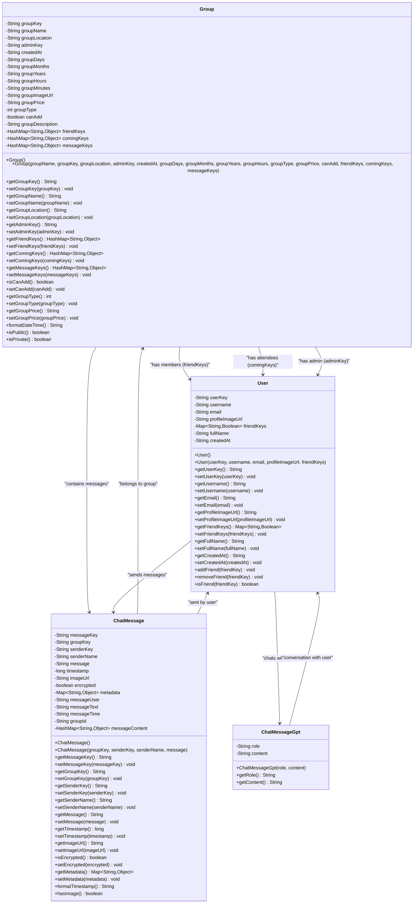

# PartyMaker - Data Models UML Diagram

## 📊 Data Models & Entities

This UML diagram shows all the data model classes and their relationships in the PartyMaker application.

---

## 🏗️ Data Models Class Diagram

---

## 🔍 Core Data Models

### **Group Entity:**
- **Primary Entity**: Represents a party/event in the system
- **Key Features**: Date/time management, member management, privacy controls
- **Relationships**: Has admin, members (friendKeys), attendees (comingKeys), messages
- **Room Database**: Annotated for local caching and offline support
- **Firebase Integration**: Serialized with alternate field names for compatibility

### **User Entity:**
- **Identity Management**: Unique userKey as primary identifier
- **Profile Data**: Username, email, profile image, full name
- **Social Features**: Friend connections through friendKeys map
- **Room Database**: Full local storage support with type converters
- **Authentication**: Integrated with Firebase Auth and custom authentication

### **ChatMessage Entity:**
- **Group Communication**: Messages within group contexts
- **Rich Content**: Text messages with optional image attachments
- **Security**: Encryption support for sensitive communications
- **Metadata**: Extensible metadata system for future features
- **Legacy Support**: Maintains compatibility with older message formats

### **ChatMessageGpt Entity:**
- **AI Integration**: Specialized for OpenAI GPT conversations
- **Conversation Tracking**: Links messages within conversation contexts
- **User Context**: Associates AI chats with specific users
- **Bidirectional**: Tracks both user messages and AI responses

---

## 🔗 Entity Relationships

### **Group-User Relationships:**
- **Admin Relationship**: One-to-one (adminKey → User)
- **Member Relationship**: One-to-many (friendKeys → Users)
- **Attendee Relationship**: One-to-many (comingKeys → Users)
- **Dynamic Membership**: Members can join/leave, affecting relationships

### **Message Relationships:**
- **Group Messages**: ChatMessage belongs to Group via groupKey
- **User Messages**: ChatMessage sent by User via senderKey
- **AI Conversations**: ChatMessageGpt linked to User conversations
- **Message Threading**: Support for message chains and replies

### **Data Validation:**
- **ValidationResult**: Comprehensive validation for all entities
- **Field-Level Validation**: Specific field error tracking
- **Business Rules**: Custom validation logic for domain rules
---

## 📋 **Data Model Summary**

### **🎯 Core Models (4)**
- **Group**: Party data with members, location, datetime, and settings
- **User**: User profiles with authentication and friend relationships
- **ChatMessage**: Group chat messages with sender info and timestamps
- **ChatMessageGpt**: Simple AI chat messages (role + content only)

### **🏗️ Architecture**
- **Room Database**: All models configured for local persistence
- **Firebase Integration**: Seamless sync with Firebase Realtime Database
- **Type Converters**: HashMap and complex type serialization
- **Entity Relationships**: Clean data relationships between parties, users, and messages

---

*4 Data models providing the foundation for party management, user profiles, and messaging throughout the app.* 