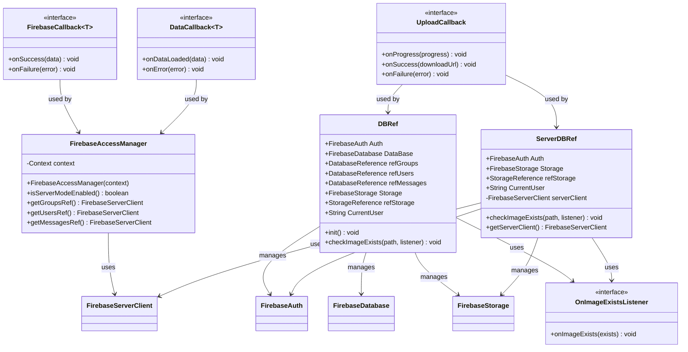

# PartyMaker - Firebase Integration UML Diagram

## 🔥 Firebase Integration Architecture

This UML diagram shows all Firebase integration components, including Authentication, Realtime Database, Storage, and Cloud Messaging services.

---

## 🏗️ Firebase Integration Class Diagram

---

## 🔍 Firebase Integration Components

### **🔥 Core Firebase Classes (3):**
- **DBRef**: Central Firebase service references (Auth, Database, Storage)
- **FirebaseAccessManager**: Routes operations to server client
- **ServerDBRef**: Server-mode replacement for direct Firebase access

### **🔧 Callback Interfaces (4):**
- **OnImageExistsListener**: Image existence check callbacks
- **FirebaseCallback<T>**: Generic success/failure callback pattern
- **DataCallback<T>**: Real-time data change event handling
- **UploadCallback**: File upload progress and completion tracking

---

## 🔄 Firebase Service Integration

### **📊 Simple Architecture:**
- **Server-First**: Most operations route through Spring Boot server
- **Direct Firebase**: Only Auth and Storage used directly
- **Callback Pattern**: Clean async operation handling
- **Reference Management**: Centralized Firebase service references

### **🔐 Authentication:**
- **Firebase Auth**: Direct Firebase Authentication integration
- **Server Integration**: Auth tokens passed to server for validation

### **📁 Storage:**
- **Firebase Storage**: Direct file upload/download capabilities
- **Image Management**: Profile and group image storage
- **Existence Checks**: Verify file existence before operations
---

## 📋 **Firebase Summary**

### **🔥 Core Firebase Components (3)**
- **FirebaseAccessManager**: Access manager that routes to server client
- **DBRef**: Firebase references helper for Auth, Database, and Storage
- **ServerDBRef**: Server-mode replacement for direct Firebase access

### **🔧 Callback Interfaces (4)**
- **OnImageExistsListener**: Image existence check callbacks
- **FirebaseCallback<T>**: Generic success/failure callback pattern
- **DataCallback<T>**: Real-time data change event handling
- **UploadCallback**: File upload progress and completion tracking

### **🏗️ Architecture**
- **Server-First Approach**: Uses Spring Boot server instead of direct Firebase access
- **Firebase Services**: Auth and Storage still used directly for specific features
- **Simple Integration**: Lightweight wrapper classes around Firebase SDK
- **Callback Management**: Clean callback interfaces for async operations

---

*Simplified Firebase integration with 3 core classes and 4 callback interfaces, using server-first architecture for data operations.* 