# PartyMaker - Firebase Integration UML Diagram

## 🔥 Firebase Integration Architecture

This UML diagram shows all Firebase integration components, including Authentication, Realtime Database, Storage, and Cloud Messaging services.

---

## 🏗️ Firebase Integration Class Diagram

```mermaid
classDiagram
    %% Core Firebase Classes
    class DBRef {
        +Auth FirebaseAuth
        +DataBase FirebaseDatabase
        +refGroups DatabaseReference
        +refUsers DatabaseReference
        +refMessages DatabaseReference
        +Storage FirebaseStorage
        +refStorage StorageReference
        +CurrentUser String
        
        +init() void
        +checkImageExists(path, listener) void
        +uploadImage(imageUri, path, listener) void
        +deleteImage(path, listener) void
        +downloadImage(path, listener) void
        +getImageDownloadUrl(path, listener) void
        -initializeReferences() void
        -validateStoragePath(path) boolean
    }
    
    class FirebaseAccessManager {
        -Context context
        -boolean serverModeEnabled
        
        +FirebaseAccessManager(context)
        +isServerModeEnabled() boolean
        +getGroupsRef() Object
        +getUsersRef() Object
        +getMessagesRef() Object
        +switchToServerMode(serverUrl) void
        +switchToDirectMode() void
        -configureAccessMode() void
    }
    
    class ServerDBRef {
        -FirebaseServerClient serverClient
        -Context context
        -String serverUrl
        
        +ServerDBRef(context)
        +getGroupsReference() FirebaseServerClient
        +getUsersReference() FirebaseServerClient
        +getMessagesReference() FirebaseServerClient
        +isServerMode() boolean
        +setServerUrl(url) void
        +testConnection() boolean
        -initializeServerClient() void
    }
    
    %% Firebase Authentication
    class FirebaseAuthManager {
        -FirebaseAuth firebaseAuth
        -Context context
        -AuthStateListener authStateListener
        -MutableLiveData~FirebaseUser~ currentUser
        
        +FirebaseAuthManager(context)
        +signInWithEmailAndPassword(email, password) Task~AuthResult~
        +createUserWithEmailAndPassword(email, password) Task~AuthResult~
        +signInWithCredential(credential) Task~AuthResult~
        +signOut() void
        +getCurrentUser() FirebaseUser
        +sendPasswordResetEmail(email) Task~Void~
        +updateUserProfile(displayName, photoUrl) Task~Void~
        +deleteUser() Task~Void~
        +addAuthStateListener(listener) void
        +removeAuthStateListener(listener) void
        +getIdToken(forceRefresh) Task~GetTokenResult~
        -setupAuthStateListener() void
        -handleAuthStateChange(user) void
    }
    
    class GoogleSignInManager {
        -GoogleSignInClient googleSignInClient
        -GoogleSignInOptions googleSignInOptions
        -Context context
        
        +GoogleSignInManager(context)
        +configureGoogleSignIn(webClientId) void
        +getSignInIntent() Intent
        +signInSilently() Task~GoogleSignInAccount~
        +handleSignInResult(result) GoogleSignInAccount
        +signOut() Task~Void~
        +revokeAccess() Task~Void~
        +getLastSignedInAccount() GoogleSignInAccount
        -buildGoogleSignInOptions(webClientId) GoogleSignInOptions
        -getAuthCredential(account) AuthCredential
    }
    
    %% Firebase Realtime Database
    class FirebaseRealtimeManager {
        -FirebaseDatabase database
        -Map~String,DatabaseReference~ references
        -Map~String,ValueEventListener~ listeners
        
        +FirebaseRealtimeManager()
        +getReference(path) DatabaseReference
        +setValue(path, value, listener) void
        +updateChildren(path, updates, listener) void
        +removeValue(path, listener) void
        +addValueEventListener(path, listener) void
        +addChildEventListener(path, listener) void
        +removeEventListener(path, listener) void
        +addListenerForSingleValueEvent(path, listener) void
        +runTransaction(path, handler) void
        +goOffline() void
        +goOnline() void
        +setPersistenceEnabled(enabled) void
        -createDatabaseReference(path) DatabaseReference
        -validatePath(path) boolean
    }
    
    class GroupDataManager {
        -FirebaseRealtimeManager realtimeManager
        -String groupsPath
        
        +GroupDataManager()
        +createGroup(group, callback) void
        +getGroup(groupKey, callback) void
        +updateGroup(groupKey, updates, callback) void
        +deleteGroup(groupKey, callback) void
        +getUserGroups(userKey, callback) void
        +addMemberToGroup(groupKey, userKey, callback) void
        +removeMemberFromGroup(groupKey, userKey, callback) void
        +updateMemberStatus(groupKey, userKey, isComing, callback) void
        +addGroupListener(groupKey, listener) void
        +removeGroupListener(groupKey) void
        -buildGroupPath(groupKey) String
        -validateGroupData(group) boolean
        -handleGroupAutoDelete(groupKey, friendKeys) void
        -reassignGroupAdmin(groupKey, friendKeys) void
    }
    
    class UserDataManager {
        -FirebaseRealtimeManager realtimeManager
        -String usersPath
        
        +UserDataManager()
        +createUser(user, callback) void
        +getUser(userKey, callback) void
        +updateUser(userKey, updates, callback) void
        +deleteUser(userKey, callback) void
        +getAllUsers(callback) void
        +searchUsers(query, callback) void
        +addUserListener(userKey, listener) void
        +removeUserListener(userKey) void
        +updateUserProfile(userKey, profileData, callback) void
        +addFriend(userKey, friendKey, callback) void
        +removeFriend(userKey, friendKey, callback) void
        -buildUserPath(userKey) String
        -validateUserData(user) boolean
    }
    
    class MessageDataManager {
        -FirebaseRealtimeManager realtimeManager
        -String messagesPath
        
        +MessageDataManager()
        +sendMessage(message, callback) void
        +getMessages(groupKey, callback) void
        +getMessage(messageKey, callback) void
        +updateMessage(messageKey, updates, callback) void
        +deleteMessage(messageKey, callback) void
        +addMessageListener(groupKey, listener) void
        +removeMessageListener(groupKey) void
        +markMessageAsRead(messageKey, userKey, callback) void
        +getUnreadMessageCount(groupKey, userKey, callback) void
        -buildMessagePath(messageKey) String
        -validateMessageData(message) boolean
        -encryptMessage(message, groupKey) String
        -decryptMessage(encryptedMessage, groupKey) String
    }
    
    %% Firebase Storage
    class FirebaseStorageManager {
        -FirebaseStorage storage
        -StorageReference storageRef
        -Map~String,StorageReference~ references
        
        +FirebaseStorageManager()
        +uploadImage(imageUri, path, callback) void
        +uploadFile(fileUri, path, callback) void
        +downloadImage(path, callback) void
        +downloadFile(path, callback) void
        +deleteFile(path, callback) void
        +getDownloadUrl(path, callback) void
        +listFiles(path, callback) void
        +getMetadata(path, callback) void
        +updateMetadata(path, metadata, callback) void
        +pauseUpload(uploadTask) void
        +resumeUpload(uploadTask) void
        +cancelUpload(uploadTask) void
        -createStorageReference(path) StorageReference
        -compressImage(imageUri) Uri
        -generateUniqueFileName(originalName) String
    }
    
    class ProfileImageManager {
        -FirebaseStorageManager storageManager
        -String profileImagesPath
        -ImageCompressor imageCompressor
        
        +ProfileImageManager()
        +uploadProfileImage(userKey, imageUri, callback) void
        +downloadProfileImage(userKey, callback) void
        +deleteProfileImage(userKey, callback) void
        +updateProfileImage(userKey, newImageUri, callback) void
        +getProfileImageUrl(userKey, callback) void
        +compressAndUpload(userKey, imageUri, callback) void
        -buildProfileImagePath(userKey) String
        -validateImageFormat(uri) boolean
        -handleUploadProgress(progress) void
    }
    
    class GroupImageManager {
        -FirebaseStorageManager storageManager
        -String groupImagesPath
        -ImageCompressor imageCompressor
        
        +GroupImageManager()
        +uploadGroupImage(groupKey, imageUri, callback) void
        +downloadGroupImage(groupKey, callback) void
        +deleteGroupImage(groupKey, callback) void
        +updateGroupImage(groupKey, newImageUri, callback) void
        +getGroupImageUrl(groupKey, callback) void
        +compressAndUpload(groupKey, imageUri, callback) void
        -buildGroupImagePath(groupKey) String
        -validateImageFormat(uri) boolean
        -handleUploadProgress(progress) void
    }
    
    %% Firebase Cloud Messaging
    class FirebaseMessagingManager {
        -FirebaseMessaging messaging
        -Context context
        -SharedPreferences preferences
        
        +FirebaseMessagingManager(context)
        +getToken(callback) void
        +subscribeToTopic(topic, callback) void
        +unsubscribeFromTopic(topic, callback) void
        +sendTokenToServer(token) void
        +handleRemoteMessage(remoteMessage) void
        +createNotificationChannel(channelId, name, importance) void
        +showNotification(title, body, data) void
        +scheduleNotification(title, body, delay) void
        +cancelNotification(notificationId) void
        +clearAllNotifications() void
        -saveTokenToPreferences(token) void
        -getStoredToken() String
        -buildNotification(title, body, data) NotificationCompat.Builder
    }
    
    class PushNotificationService {
        -FirebaseMessagingManager messagingManager
        -NotificationManager notificationManager
        
        +PushNotificationService()
        +onMessageReceived(remoteMessage) void
        +onNewToken(token) void
        +handleGroupNotification(data) void
        +handleChatNotification(data) void
        +handleSystemNotification(data) void
        +sendGroupInviteNotification(groupName, inviterName, recipientToken) void
        +sendChatMessageNotification(senderName, message, groupName, recipientToken) void
        +sendSystemNotification(title, body, recipientToken) void
        -createNotificationIntent(data) Intent
        -generateNotificationId() int
    }
    
    %% Firebase Configuration
    class FirebaseInitializer {
        -Context context
        -FirebaseApp firebaseApp
        
        +FirebaseInitializer(context)
        +initializeFirebase() void
        +configureFirebaseServices() void
        +enablePersistence() void
        +setLogLevel(level) void
        +getFirebaseApp() FirebaseApp
        +isFirebaseInitialized() boolean
        -loadFirebaseConfig() void
        -validateFirebaseConfig() boolean
        -setupDefaultSettings() void
    }
    
    %% Callback Interfaces
    class FirebaseCallback~T~ {
        <<interface>>
        +onSuccess(result) void
        +onFailure(exception) void
    }
    
    class DataCallback~T~ {
        <<interface>>
        +onDataReceived(data) void
        +onError(error) void
        +onDataChanged(data) void
        +onDataRemoved(key) void
    }
    
    class UploadCallback {
        <<interface>>
        +onProgress(progress) void
        +onSuccess(downloadUrl) void
        +onFailure(exception) void
        +onPaused() void
        +onResumed() void
    }
    
    class AuthCallback {
        <<interface>>
        +onAuthSuccess(user) void
        +onAuthFailure(exception) void
        +onAuthStateChanged(user) void
    }

    %% Relationships
    DBRef --> FirebaseAuth : manages
    DBRef --> FirebaseDatabase : manages
    DBRef --> FirebaseStorage : manages
    
    FirebaseAccessManager --> ServerDBRef : creates
    FirebaseAccessManager --> DBRef : uses
    
    ServerDBRef --> FirebaseServerClient : uses
    
    FirebaseAuthManager --> FirebaseAuth : uses
    FirebaseAuthManager --> AuthCallback : uses
    
    GoogleSignInManager --> GoogleSignInClient : uses
    GoogleSignInManager --> GoogleSignInOptions : uses
    
    FirebaseRealtimeManager --> FirebaseDatabase : uses
    FirebaseRealtimeManager --> DatabaseReference : manages
    FirebaseRealtimeManager --> ValueEventListener : manages
    
    GroupDataManager --> FirebaseRealtimeManager : uses
    GroupDataManager --> DataCallback : uses
    
    UserDataManager --> FirebaseRealtimeManager : uses
    UserDataManager --> DataCallback : uses
    
    MessageDataManager --> FirebaseRealtimeManager : uses
    MessageDataManager --> DataCallback : uses
    
    FirebaseStorageManager --> FirebaseStorage : uses
    FirebaseStorageManager --> StorageReference : manages
    FirebaseStorageManager --> UploadCallback : uses
    
    ProfileImageManager --> FirebaseStorageManager : uses
    ProfileImageManager --> ImageCompressor : uses
    
    GroupImageManager --> FirebaseStorageManager : uses
    GroupImageManager --> ImageCompressor : uses
    
    FirebaseMessagingManager --> FirebaseMessaging : uses
    FirebaseMessagingManager --> NotificationManager : uses
    
    PushNotificationService --> FirebaseMessagingManager : uses
    PushNotificationService --> FirebaseMessagingService : extends
    
    FirebaseInitializer --> FirebaseApp : creates
    FirebaseInitializer --> Context : uses
    
    %% Generic Callback Usage
    GroupDataManager ..> FirebaseCallback : implements
    UserDataManager ..> FirebaseCallback : implements
    MessageDataManager ..> FirebaseCallback : implements
    FirebaseStorageManager ..> UploadCallback : implements
    FirebaseAuthManager ..> AuthCallback : implements
```

---

## 🔍 Firebase Integration Components

### **🔥 Core Firebase Services:**
- **DBRef**: Central Firebase service references and initialization
- **FirebaseAccessManager**: Mode switching between direct Firebase and server-mediated access
- **ServerDBRef**: Server-side Firebase access management
- **FirebaseInitializer**: Firebase SDK initialization and configuration

### **🔐 Authentication Integration:**
- **FirebaseAuthManager**: Firebase Authentication service wrapper
- **GoogleSignInManager**: Google Sign-In integration with Firebase Auth
- **Auth State Management**: Real-time authentication state monitoring
- **Token Management**: ID token generation and validation

### **📊 Realtime Database Management:**
- **FirebaseRealtimeManager**: Core Realtime Database operations
- **GroupDataManager**: Group-specific database operations
- **UserDataManager**: User-specific database operations
- **MessageDataManager**: Message-specific database operations

### **📁 Storage Management:**
- **FirebaseStorageManager**: Core Cloud Storage operations
- **ProfileImageManager**: User profile image management
- **GroupImageManager**: Group image management
- **File Upload/Download**: Comprehensive file management with progress tracking

### **📱 Cloud Messaging:**
- **FirebaseMessagingManager**: FCM token and topic management
- **PushNotificationService**: Notification handling and display
- **Notification Categories**: Group, chat, and system notifications

---

## 🔄 Firebase Service Integration

### **📊 Data Flow Patterns:**
- **Real-time Listeners**: Live data updates via ValueEventListener and ChildEventListener
- **Single Value Events**: One-time data retrieval for specific operations
- **Batch Operations**: Efficient bulk data updates using updateChildren()
- **Transactions**: Atomic operations for critical data modifications

### **🔐 Authentication Flow:**
- **Multi-provider Auth**: Email/password and Google Sign-In support
- **Auth State Persistence**: Automatic session restoration across app restarts
- **Token Refresh**: Automatic ID token refresh for server authentication
- **Profile Management**: User profile updates and photo management

### **📁 Storage Operations:**
- **Progressive Upload**: Chunked upload with progress tracking
- **Image Optimization**: Automatic compression before upload
- **Metadata Management**: File metadata storage and retrieval
- **URL Generation**: Secure download URL generation with expiration

---

## 🎯 Advanced Firebase Features

### **⚡ Performance Optimization:**
- **Offline Persistence**: Local caching with automatic synchronization
- **Connection Management**: Smart online/offline state handling
- **Batch Operations**: Reduced network calls through batching
- **Lazy Loading**: On-demand data loading for better performance

### **🔍 Real-time Features:**
- **Live Updates**: Instant UI updates via Firebase listeners
- **Presence System**: User online/offline status tracking
- **Collaborative Editing**: Real-time group data synchronization
- **Conflict Resolution**: Automatic conflict resolution for concurrent updates

### **📱 Push Notifications:**
- **Topic Subscriptions**: Group-based notification topics
- **Targeted Messaging**: User-specific push notifications
- **Rich Notifications**: Notifications with images and actions
- **Background Handling**: Notification processing when app is closed

---

## 🛡️ Security & Data Protection

### **🔐 Security Rules Integration:**
- **Authentication-based Rules**: Firebase security rules based on auth state
- **Data Validation**: Server-side data validation through security rules
- **Access Control**: Granular read/write permissions per data node
- **Anti-tampering**: Protection against client-side data manipulation

### **🔒 Data Encryption:**
- **End-to-End Encryption**: Message encryption before Firebase storage
- **Key Management**: Secure key distribution and rotation
- **Sensitive Data**: Additional encryption for sensitive user information
- **Compliance**: GDPR and privacy regulation compliance

### **📊 Audit & Monitoring:**
- **Access Logging**: Comprehensive logging of data access patterns
- **Security Monitoring**: Real-time security event detection
- **Performance Metrics**: Firebase operation performance tracking
- **Error Analytics**: Structured error reporting and analysis

---

## 🔄 Callback & Event Handling

### **📡 Callback Interfaces:**
- **FirebaseCallback<T>**: Generic success/failure callback pattern
- **DataCallback<T>**: Real-time data change callbacks
- **UploadCallback**: File upload progress and completion callbacks
- **AuthCallback**: Authentication state change callbacks

### **🎭 Event Management:**
- **Listener Registration**: Automatic listener lifecycle management
- **Memory Leak Prevention**: Proper listener cleanup and garbage collection
- **Event Filtering**: Selective event handling based on criteria
- **Error Recovery**: Automatic retry and fallback mechanisms

---

*This Firebase integration architecture provides comprehensive, secure, and performant access to all Firebase services, with robust error handling, offline support, and real-time synchronization capabilities throughout the PartyMaker application.* 