# PartyMaker - Network & API Components UML Diagram

## 🌐 Network Architecture & API Integration

This UML diagram shows all networking components, API clients, connectivity management, and external service integrations in the PartyMaker application.

---

## 🏗️ Network & API Class Diagram

```mermaid
classDiagram
    %% Core Network Classes
    class NetworkManager {
        -ConnectivityManager connectivityManager
        -String baseUrl
        -OkHttpClient httpClient
        -boolean isOnline
        -NetworkCallback networkCallback
        -List~NetworkStateListener~ listeners
        
        +NetworkManager(context)
        +initialize() void
        +setServerUrl(url) void
        +isNetworkAvailable() boolean
        +executeWithRetry(request) Response
        +registerNetworkCallback() void
        +unregisterNetworkCallback() void
        +addNetworkStateListener(listener) void
        +removeNetworkStateListener(listener) void
        +getNetworkInfo() NetworkInfo
        +isWifiConnected() boolean
        +isMobileConnected() boolean
        -createHttpClient() OkHttpClient
        -handleNetworkChange(isConnected) void
        -notifyNetworkStateChange(isConnected) void
    }
    
    class ConnectivityManager {
        -Context context
        -android.net.ConnectivityManager systemConnectivityManager
        -NetworkRequest networkRequest
        -NetworkCallback networkCallback
        -boolean isConnected
        -NetworkType currentNetworkType
        
        +ConnectivityManager(context)
        +getInstance() ConnectivityManager
        +isNetworkAvailable() boolean
        +getActiveNetworkInfo() NetworkInfo
        +registerNetworkCallback() void
        +unregisterNetworkCallback() void
        +addNetworkListener(listener) void
        +removeNetworkListener(listener) void
        +getCurrentNetworkType() NetworkType
        +isMeteredConnection() boolean
        +getConnectionQuality() ConnectionQuality
        -createNetworkRequest() NetworkRequest
        -createNetworkCallback() NetworkCallback
        -notifyNetworkChange(isConnected) void
        -analyzeNetworkCapabilities(capabilities) ConnectionQuality
    }
    
    %% API Clients
    class FirebaseServerClient {
        -String baseUrl
        -OkHttpClient httpClient
        -Gson gson
        -ConnectivityManager connectivityManager
        -ExecutorService executorService
        -Map~String,String~ defaultHeaders
        -RetryPolicy retryPolicy
        
        +getInstance() FirebaseServerClient
        +initialize(context) void
        +getUserGroups(userKey) List~Group~
        +getGroup(groupKey) Group
        +createGroup(group) Group
        +updateGroup(groupKey, updates) Group
        +deleteGroup(groupKey) boolean
        +getUser(userKey) User
        +updateUser(userKey, updates) User
        +getMessages(groupKey) List~ChatMessage~
        +sendMessage(message) ChatMessage
        +executeRequest(request) Response
        +buildHttpRequest(endpoint) Request
        +setAuthToken(token) void
        +setTimeout(timeout) void
        -handleResponse(response) Object
        -handleError(error) void
        -buildRequestBody(data) RequestBody
        -addDefaultHeaders(builder) void
    }
    
    class OpenAiApi {
        -String apiKey
        -String baseUrl
        -OkHttpClient httpClient
        -Gson gson
        -int maxTokens
        -double temperature
        -String model
        
        +OpenAiApi(apiKey)
        +sendChatMessage(message, conversationHistory) ChatCompletionResponse
        +sendChatMessageAsync(message, conversationHistory, callback) void
        +createCompletion(prompt) CompletionResponse
        +createCompletionAsync(prompt, callback) void
        +setModel(model) void
        +setTemperature(temperature) void
        +setMaxTokens(maxTokens) void
        +validateApiKey() boolean
        +getUsage() ApiUsage
        -buildChatRequest(message, history) ChatCompletionRequest
        -buildCompletionRequest(prompt) CompletionRequest
        -handleApiResponse(response) Object
        -handleApiError(error) void
    }
    

    
    %% Network Utilities
    class NetworkUtils {
        +isValidUrl(url) boolean
        +isReachable(url, timeout) boolean
        +getResponseTime(url) long
        +downloadFile(url, destination, callback) void
        +uploadFile(url, file, callback) void
        +getNetworkType(context) NetworkType
        +getConnectionSpeed(context) double
        +isRoaming(context) boolean
        +getSignalStrength(context) int
        +pingHost(host, timeout) long
        +traceRoute(host) List~String~
        +getPublicIpAddress() String
        +getDnsServers() List~String~
        -executeNetworkOperation(operation) Object
        -measureNetworkLatency(url) long
    }
    
    class RetryPolicy {
        -int maxRetries
        -long initialDelay
        -double backoffMultiplier
        -long maxDelay
        -Set~Integer~ retryableStatusCodes
        
        +RetryPolicy()
        +shouldRetry(attempt, exception) boolean
        +getDelay(attempt) long
        +getMaxRetries() int
        +setMaxRetries(maxRetries) void
        +addRetryableStatusCode(statusCode) void
        +removeRetryableStatusCode(statusCode) void
        +isRetryableException(exception) boolean
        -calculateBackoffDelay(attempt) long
        -isRetryableStatusCode(statusCode) boolean
    }
    
    class RequestInterceptor {
        -String authToken
        -Map~String,String~ defaultHeaders
        -boolean loggingEnabled
        
        +RequestInterceptor()
        +intercept(chain) Response
        +setAuthToken(token) void
        +addDefaultHeader(name, value) void
        +removeDefaultHeader(name) void
        +enableLogging(enabled) void
        -addAuthHeader(builder) void
        -addDefaultHeaders(builder) void
        -logRequest(request) void
        -logResponse(response) void
    }
    
    class ResponseInterceptor {
        -boolean cachingEnabled
        -long cacheMaxAge
        -Set~Integer~ cachableStatusCodes
        
        +ResponseInterceptor()
        +intercept(chain) Response
        +enableCaching(enabled) void
        +setCacheMaxAge(maxAge) void
        +addCachableStatusCode(statusCode) void
        -addCacheHeaders(response) Response
        -isCachableResponse(response) boolean
        -buildCacheHeader(maxAge) String
    }
    
    %% Error Handling
    class AppNetworkError {
        -int errorCode
        -String errorMessage
        -String endpoint
        -long timestamp
        -NetworkErrorType errorType
        -Exception cause
        
        +AppNetworkError(code, message, endpoint)
        +getErrorCode() int
        +getErrorMessage() String
        +getEndpoint() String
        +getTimestamp() long
        +getErrorType() NetworkErrorType
        +getCause() Exception
        +isRetryable() boolean
        +isClientError() boolean
        +isServerError() boolean
        +isNetworkError() boolean
        +toString() String
        +toJson() String
    }
    
    class NetworkErrorHandler {
        -Map~Integer,String~ errorMessages
        -RetryPolicy retryPolicy
        
        +NetworkErrorHandler()
        +handleError(error) NetworkErrorResponse
        +isRetryableError(error) boolean
        +getErrorMessage(errorCode) String
        +addCustomErrorMessage(code, message) void
        +shouldShowToUser(error) boolean
        +getRecoveryAction(error) RecoveryAction
        -mapHttpErrorToUserMessage(code) String
        -determineErrorType(error) NetworkErrorType
        -createErrorResponse(error) NetworkErrorResponse
    }
    
    %% Response Models
    class ApiResponse~T~ {
        -T data
        -boolean success
        -String message
        -int statusCode
        -Map~String,String~ headers
        -long responseTime
        
        +ApiResponse()
        +success(data) ApiResponse~T~
        +error(message, statusCode) ApiResponse~T~
        +getData() T
        +isSuccess() boolean
        +getMessage() String
        +getStatusCode() int
        +getHeaders() Map~String,String~
        +getResponseTime() long
        +hasData() boolean
        +map(mapper) ApiResponse~U~
    }
    
    class ChatCompletionResponse {
        -String id
        -String object
        -long created
        -String model
        -List~Choice~ choices
        -Usage usage
        
        +ChatCompletionResponse()
        +getId() String
        +getChoices() List~Choice~
        +getFirstChoice() Choice
        +getUsage() Usage
        +getResponseText() String
        +getTotalTokens() int
        +getPromptTokens() int
        +getCompletionTokens() int
    }
    
    class PlacesResponse {
        -List~Place~ results
        -String status
        -String nextPageToken
        -List~String~ htmlAttributions
        
        +PlacesResponse()
        +getResults() List~Place~
        +getStatus() String
        +getNextPageToken() String
        +hasMoreResults() boolean
        +isSuccessful() boolean
        +getFirstResult() Place
    }
    
    %% Callback Interfaces
    class NetworkCallback {
        <<interface>>
        +onNetworkAvailable() void
        +onNetworkLost() void
        +onNetworkCapabilitiesChanged(capabilities) void
    }
    
    class ApiCallback~T~ {
        <<interface>>
        +onSuccess(response) void
        +onFailure(error) void
        +onProgress(progress) void
    }
    
    class DownloadCallback {
        <<interface>>
        +onProgress(bytesDownloaded, totalBytes) void
        +onSuccess(file) void
        +onFailure(error) void
        +onPaused() void
        +onResumed() void
        +onCancelled() void
    }
    
    class UploadCallback {
        <<interface>>
        +onProgress(bytesUploaded, totalBytes) void
        +onSuccess(response) void
        +onFailure(error) void
        +onStarted() void
        +onCompleted() void
    }
    
    %% Enums
    class NetworkType {
        <<enumeration>>
        WIFI
        MOBILE
        ETHERNET
        BLUETOOTH
        VPN
        UNKNOWN
    }
    
    class ConnectionQuality {
        <<enumeration>>
        EXCELLENT
        GOOD
        FAIR
        POOR
        NO_CONNECTION
    }
    
    class NetworkErrorType {
        <<enumeration>>
        TIMEOUT
        NO_CONNECTION
        DNS_RESOLUTION
        SSL_HANDSHAKE
        HTTP_ERROR
        PARSE_ERROR
        UNKNOWN
    }

    %% Relationships
    NetworkManager --> ConnectivityManager : uses
    NetworkManager --> OkHttpClient : manages
    NetworkManager --> NetworkCallback : implements
    
    ConnectivityManager --> android.net.ConnectivityManager : wraps
    ConnectivityManager --> NetworkType : returns
    ConnectivityManager --> ConnectionQuality : evaluates
    
    FirebaseServerClient --> NetworkManager : uses
    FirebaseServerClient --> OkHttpClient : uses
    FirebaseServerClient --> RetryPolicy : uses
    FirebaseServerClient --> RequestInterceptor : uses
    FirebaseServerClient --> ResponseInterceptor : uses
    
    OpenAiApi --> OkHttpClient : uses
    OpenAiApi --> ChatCompletionResponse : returns
    OpenAiApi --> ApiCallback : uses
    

    
    NetworkUtils --> NetworkType : returns
    NetworkUtils --> DownloadCallback : uses
    NetworkUtils --> UploadCallback : uses
    
    RetryPolicy --> NetworkErrorType : evaluates
    
    RequestInterceptor --> Interceptor : implements
    ResponseInterceptor --> Interceptor : implements
    
    AppNetworkError --> NetworkErrorType : uses
    NetworkErrorHandler --> AppNetworkError : handles
    NetworkErrorHandler --> RetryPolicy : uses
    
    ApiResponse --> ApiCallback : used by
    
    %% Client Dependencies
    FirebaseServerClient ..> ApiResponse : returns
    OpenAiApi ..> ApiResponse : returns

    
    %% Error Handling Flow
    NetworkManager --> AppNetworkError : creates
    NetworkManager --> NetworkErrorHandler : uses
    
    FirebaseServerClient --> AppNetworkError : throws
    OpenAiApi --> AppNetworkError : throws

```

---

## 🔍 Network Architecture Components

### **🌐 Core Network Management:**
- **NetworkManager**: Central network state management and HTTP client configuration
- **ConnectivityManager**: Real-time connectivity monitoring and network type detection
- **Network State Tracking**: Live monitoring of connection status and quality
- **Connection Quality Assessment**: Bandwidth and latency-based quality evaluation

### **🔌 API Client Architecture:**
- **FirebaseServerClient**: Custom server API integration with retry logic
- **OpenAiApi**: OpenAI GPT API integration for AI chat functionality

- **Unified API Pattern**: Consistent API client architecture across all services

### **🛠️ Network Utilities:**
- **NetworkUtils**: Network diagnostic and utility functions
- **RetryPolicy**: Configurable retry mechanisms with exponential backoff
- **Request/Response Interceptors**: HTTP request/response modification and logging
- **Error Handling**: Comprehensive network error management and recovery

---

## 🚀 API Integration Features

### **🤖 OpenAI Integration:**
- **Chat Completions**: GPT-4 powered conversational AI
- **Conversation Context**: Maintains conversation history for context
- **Streaming Support**: Real-time response streaming for better UX
- **Usage Tracking**: Token usage monitoring and cost management

### **🗺️ Google Maps Integration:**
- **Places Search**: Location search and discovery
- **Geocoding**: Address to coordinates conversion
- **Reverse Geocoding**: Coordinates to address conversion
- **Place Details**: Comprehensive location information retrieval
- **Autocomplete**: Real-time place name suggestions

### **🔥 Firebase Server Integration:**
- **RESTful API**: Full CRUD operations via custom server
- **Authentication**: JWT token-based authentication
- **Real-time Updates**: WebSocket-like functionality via polling
- **Batch Operations**: Efficient bulk data operations

---

## ⚡ Performance & Optimization

### **🔄 Connection Management:**
- **Connection Pooling**: Efficient HTTP connection reuse
- **Keep-Alive**: Persistent connections for better performance
- **Timeout Configuration**: Configurable timeouts for different operations
- **Request Queuing**: Intelligent request queuing and prioritization

### **📊 Caching Strategy:**
- **HTTP Caching**: Standard HTTP cache headers and validation
- **Response Caching**: Intelligent response caching with TTL
- **Cache Invalidation**: Smart cache invalidation strategies
- **Offline Support**: Cached responses for offline functionality

### **🔁 Retry Mechanisms:**
- **Exponential Backoff**: Intelligent retry delays to prevent server overload
- **Selective Retries**: Retry only on specific error conditions
- **Circuit Breaker**: Fail-fast mechanism for persistent errors
- **Jitter**: Random delay addition to prevent thundering herd

---

## 🛡️ Network Security

### **🔐 Request Security:**
- **SSL Pinning**: Certificate pinning for enhanced security
- **Request Signing**: HMAC-based request authentication
- **API Key Management**: Secure API key storage and rotation
- **Token Refresh**: Automatic authentication token refresh

### **🔍 Request/Response Logging:**
- **Debug Logging**: Comprehensive request/response logging for debugging
- **Sensitive Data Filtering**: Automatic filtering of sensitive information
- **Performance Metrics**: Request timing and performance tracking
- **Error Analytics**: Structured error logging and analysis

### **🛠️ Input Validation:**
- **Request Validation**: Client-side request validation before sending
- **Response Validation**: Server response validation and sanitization
- **Data Sanitization**: Input sanitization to prevent injection attacks
- **Rate Limiting**: Client-side rate limiting to prevent abuse

---

## 📱 Mobile Network Optimization

### **🔋 Battery Optimization:**
- **Background Sync**: Intelligent background synchronization
- **Network Type Awareness**: Different strategies for WiFi vs. mobile data
---

## 📋 **Networking Summary**

### **🌐 HTTP Clients**
- **FirebaseServerClient**: Main HTTP client for server communication
- **NetworkManager**: Network operations and connection management
- **ConnectivityManager**: Network connectivity monitoring and status

### **🔧 Network Utilities**
- **NetworkUtils**: Network error handling and type classification
- **AppNetworkError**: Custom network error definitions
- **Result<T>**: Network response wrapping with success/error states

### **🏗️ Architecture**
- **OkHttpClient**: Modern HTTP client with connection pooling
- **SSL/TLS Security**: Secure connections with certificate validation
- **Error Handling**: Comprehensive error classification and recovery
- **Offline Support**: Graceful handling of network unavailability

### **📊 Features**
- **Request/Response**: JSON serialization with Gson
- **Connection Pooling**: Efficient connection reuse
- **Timeout Management**: Configurable timeouts for different operations
- **Retry Logic**: Automatic retry for transient network errors

---

*Network layer providing secure, efficient HTTP communication with comprehensive error handling and offline support.* 