# PartyMaker - Repository Pattern & Data Layer UML Diagram

## 🗃️ Repository Pattern & Data Access Layer

This UML diagram shows the Repository pattern implementation and all data layer components in the PartyMaker application.

---

## 🏗️ Repository & Data Layer Class Diagram

```mermaid
classDiagram
    %% Repository Interfaces & Implementations
    class GroupRepository {
        -LocalGroupDataSource localDataSource
        -RemoteGroupDataSource remoteDataSource
        -Context applicationContext
        -boolean isInitialized
        
        +getInstance() GroupRepository
        +initialize(context) void
        +getUserGroups(userKey) LiveData~List~Group~~
        +getGroup(groupKey) LiveData~Group~
        +createGroup(group) LiveData~Result~Group~~
        +updateGroup(groupKey, updates) LiveData~Result~Group~~
        +deleteGroup(groupKey) LiveData~Result~Boolean~~
        +getPublicGroups() LiveData~List~Group~~
        +joinGroup(groupKey, userKey) LiveData~Result~Boolean~~
        +leaveGroup(groupKey, userKey) LiveData~Result~Boolean~~
        +refreshUserGroups(userKey) void
        +syncWithRemote() void
        -handleCacheStrategy(data) void
        -handleNetworkError(error) void
    }
    
    class UserRepository {
        -FirebaseServerClient serverClient
        -AppDatabase database
        -MutableLiveData~Map~String,User~~ allUsers
        -MutableLiveData~User~ currentUser
        -Map~String,User~ userCache
        
        +getInstance() UserRepository
        +initialize(context) void
        +getCurrentUser() LiveData~User~
        +getUser(userKey) LiveData~User~
        +getAllUsers() LiveData~Map~String,User~~
        +createUser(user) void
        +updateUser(userKey, updates) void
        +deleteUser(userKey) void
        +getUsersByKeys(userKeys) LiveData~List~User~~
        +searchUsers(query) LiveData~List~User~~
        +refreshUserData(userKey) void
        +clearCache() void
        -isCurrentUser(userId) boolean
        -applyUpdatesToUser(user, updates) void
    }
    
    %% Data Sources
    
    %% Database Components
    class AppDatabase {
        -volatile AppDatabase INSTANCE
        
        +getInstance(context) AppDatabase
        +groupDao() GroupDao
        +userDao() UserDao
        +chatMessageDao() ChatMessageDao
        +clearAllTables() void
        -buildDatabase(context) AppDatabase
        -addCallback() Callback
    }
    
    class GroupDao {
        +getAllGroups() LiveData~List~GroupEntity~~
        +getUserGroups(userKey) LiveData~List~GroupEntity~~
        +getGroup(groupKey) LiveData~GroupEntity~
        +getPublicGroups() LiveData~List~GroupEntity~~
        +insertGroup(group) void
        +insertGroups(groups) void
        +updateGroup(group) void
        +deleteGroup(groupKey) void
        +deleteAllGroups() void
        +getGroupCount() int
        +searchGroups(query) LiveData~List~GroupEntity~~
    }
    
    class UserDao {
        +getAllUsers() LiveData~List~UserEntity~~
        +getUser(userKey) LiveData~UserEntity~
        +getUsersByKeys(userKeys) LiveData~List~UserEntity~~
        +insertUser(user) void
        +insertUsers(users) void
        +updateUser(user) void
        +deleteUser(userKey) void
        +deleteAllUsers() void
        +getUserCount() int
        +searchUsers(query) LiveData~List~UserEntity~~
    }
    
    class ChatMessageDao {
        +getAllMessages() LiveData~List~ChatMessageEntity~~
        +getGroupMessages(groupKey) LiveData~List~ChatMessageEntity~~
        +getUserMessages(userKey) LiveData~List~ChatMessageEntity~~
        +getMessage(messageKey) LiveData~ChatMessageEntity~
        +insertMessage(message) void
        +insertMessages(messages) void
        +updateMessage(message) void
        +deleteMessage(messageKey) void
        +deleteGroupMessages(groupKey) void
        +deleteAllMessages() void
        +getMessageCount() int
    }
    
    %% Type Converters
    class Converters {
        +fromHashMap(map) String
        +toHashMap(json) HashMap~String,Object~
        +fromStringMap(map) String
        +toStringMap(json) Map~String,Boolean~
        +fromTimestamp(timestamp) Date
        +toTimestamp(date) Long
        +fromStringList(list) String
        +toStringList(json) List~String~
    }
    
    %% API & Network Layer
    class FirebaseServerClient {
        -String baseUrl
        -OkHttpClient httpClient
        -Gson gson
        -ConnectivityManager connectivityManager
        -ExecutorService executorService
        
        +getInstance() FirebaseServerClient
        +initialize(context) void
        +getUserGroups(userKey) List~Group~
        +getGroup(groupKey) Group
        +createGroup(group) Group
        +updateGroup(groupKey, updates) Group
        +deleteGroup(groupKey) boolean
        +getUser(userKey) User
        +updateUser(userKey, updates) User
        +getMessages(groupKey) List~ChatMessage~
        +sendMessage(message) ChatMessage
        +executeRequest(request) Response
        +buildHttpRequest(endpoint) Request
        -handleResponse(response) Object
        -handleError(error) void
    }
    
    class NetworkManager {
        -ConnectivityManager connectivityManager
        -String baseUrl
        -OkHttpClient httpClient
        -boolean isOnline
        
        +NetworkManager(context)
        +initialize() void
        +setServerUrl(url) void
        +isNetworkAvailable() boolean
        +executeWithRetry(request) Response
        +registerNetworkCallback() void
        +unregisterNetworkCallback() void
        -createHttpClient() OkHttpClient
        -handleNetworkChange(isConnected) void
    }
    
    class ConnectivityManager {
        -Context context
        -NetworkCallback networkCallback
        -boolean isConnected
        
        +ConnectivityManager(context)
        +getInstance() ConnectivityManager
        +isNetworkAvailable() boolean
        +getActiveNetworkInfo() NetworkInfo
        +registerNetworkCallback() void
        +unregisterNetworkCallback() void
        +addNetworkListener(listener) void
        +removeNetworkListener(listener) void
        -notifyNetworkChange(isConnected) void
    }
    
    %% Firebase Integration
    class DBRef {
        +Auth FirebaseAuth
        +DataBase FirebaseDatabase
        +refGroups DatabaseReference
        +refUsers DatabaseReference
        +refMessages DatabaseReference
        +Storage FirebaseStorage
        +refStorage StorageReference
        +CurrentUser String
        
        +init() void
        +checkImageExists(path, listener) void
        +uploadImage(imageUri, path, listener) void
        +deleteImage(path, listener) void
    }
    
    class FirebaseAccessManager {
        -Context context
        
        +FirebaseAccessManager(context)
        +isServerModeEnabled() boolean
        +getGroupsRef() FirebaseServerClient
        +getUsersRef() FirebaseServerClient
        +getMessagesRef() FirebaseServerClient
    }
    
    class ServerDBRef {
        -FirebaseServerClient serverClient
        -Context context
        
        +ServerDBRef(context)
        +getGroupsReference() FirebaseServerClient
        +getUsersReference() FirebaseServerClient
        +getMessagesReference() FirebaseServerClient
        +isServerMode() boolean
    }
    
    %% Utility Classes
    class Result~T~ {
        -T data
        -boolean success
        -String errorMessage
        -Exception exception
        
        +success(data) Result~T~
        +error(errorMessage) Result~T~
        +error(exception) Result~T~
        +getData() T
        +isSuccess() boolean
        +getErrorMessage() String
        +getException() Exception
        +map(mapper) Result~U~
        +flatMap(mapper) Result~U~
    }
    
    class AppNetworkError {
        -int errorCode
        -String errorMessage
        -String endpoint
        -long timestamp
        
        +AppNetworkError(code, message, endpoint)
        +getErrorCode() int
        +getErrorMessage() String
        +getEndpoint() String
        +getTimestamp() long
        +isRetryable() boolean
        +toString() String
    }

    %% Relationships
    GroupRepository --> LocalGroupDataSource : uses
    GroupRepository --> RemoteGroupDataSource : uses
    UserRepository --> FirebaseServerClient : uses
    UserRepository --> AppDatabase : uses
    
    LocalGroupDataSource --> AppDatabase : uses
    LocalGroupDataSource --> GroupDao : uses
    LocalGroupDataSource --> UserDao : uses
    
    RemoteGroupDataSource --> FirebaseServerClient : uses
    RemoteGroupDataSource --> NetworkUtils : uses
    
    AppDatabase --> GroupDao : provides
    AppDatabase --> UserDao : provides
    AppDatabase --> ChatMessageDao : provides
    AppDatabase --> Converters : uses
    
    FirebaseServerClient --> NetworkManager : uses
    FirebaseServerClient --> ConnectivityManager : uses
    FirebaseServerClient --> Result : returns
    FirebaseServerClient --> AppNetworkError : throws
    
    NetworkManager --> ConnectivityManager : uses
    
    FirebaseAccessManager --> FirebaseServerClient : creates
    ServerDBRef --> FirebaseServerClient : uses
    
    DBRef --> FirebaseAuth : manages
    DBRef --> FirebaseDatabase : manages
    DBRef --> FirebaseStorage : manages
    
    %% Repository Relationships
    GroupRepository ..> Result : returns
    UserRepository ..> Result : returns
    LocalGroupDataSource ..> List : returns
    RemoteGroupDataSource ..> List : returns
```

---

## 🔍 Repository Pattern Implementation

### **🏛️ Repository Layer:**
- **GroupRepository**: Central access point for all group-related data operations
- **UserRepository**: Manages user data with caching and synchronization
- **Singleton Pattern**: Ensures single instances across the application
- **Context Initialization**: Proper context management for database access

### **📊 Data Source Strategy:**
- **LocalGroupDataSource**: Room database operations for offline support
- **RemoteGroupDataSource**: Network operations via FirebaseServerClient
- **Cache-First Strategy**: Prioritizes local data with network fallback
- **Bi-directional Sync**: Automatic synchronization between local and remote

### **🗄️ Database Layer:**
- **AppDatabase**: Room database with migration support
- **DAO Pattern**: Data Access Objects for type-safe database operations
- **LiveData Integration**: Reactive database queries with automatic updates
- **Type Converters**: Handles complex data types like HashMaps and Lists

---

## 🌐 Network & API Layer

### **🔌 Network Management:**
- **FirebaseServerClient**: HTTP client for server communication
- **NetworkManager**: Network state monitoring and retry logic
- **ConnectivityManager**: Real-time connectivity status tracking
- **Connection Pooling**: Efficient HTTP connection management

### **🔄 Error Handling:**
- **Result Pattern**: Functional error handling with success/error states
- **AppNetworkError**: Structured network error information
- **Retry Mechanisms**: Exponential backoff for failed requests
- **Graceful Degradation**: Fallback to local data when network fails

### **🔐 Firebase Integration:**
- **DBRef**: Static Firebase service references
- **FirebaseAccessManager**: Server mode configuration
- **ServerDBRef**: Server-side Firebase reference management
- **Dual Mode Support**: Direct Firebase or server-mediated access

---

## 📱 Local Storage Architecture

### **🏠 Room Database:**
- **Entity Definitions**: Annotated data classes for database tables
- **Relationship Mapping**: Foreign keys and junction tables
- **Migration Strategy**: Version-controlled schema migrations
- **Thread Safety**: Background thread operations with coroutines

### **🔄 Type Conversion:**
- **Complex Types**: HashMap and Map serialization/deserialization
- **Date Handling**: Timestamp conversion for date objects
- **JSON Support**: Gson integration for complex object storage
- **Null Safety**: Proper handling of nullable database fields

### **📊 Query Optimization:**
- **Indexed Queries**: Strategic database indexing for performance
- **Lazy Loading**: On-demand data loading to reduce memory usage
- **Batch Operations**: Efficient bulk insert/update operations
- **Query Caching**: Room's built-in query result caching

---

## 📋 **Repository Summary**

### **🎯 Core Repositories (2)**
- **GroupRepository**: Party data management with local/remote sync
- **UserRepository**: User profile and authentication data management

### **🏗️ Data Sources**
- **LocalGroupDataSource**: Room database operations for offline storage
- **RemoteGroupDataSource**: Firebase server client for cloud sync
- **AppDatabase**: Room database with DAOs for local persistence
- **FirebaseServerClient**: HTTP client for server communication

### **🔄 Architecture**
- **Repository Pattern**: Single source of truth for data access
- **Cache-First Strategy**: Local data priority with background sync
- **LiveData Integration**: Reactive UI updates through observers
- **Offline Support**: Full functionality with cached data

---

*Repository layer providing unified data access with local caching, remote synchronization, and offline support for groups and users.* 