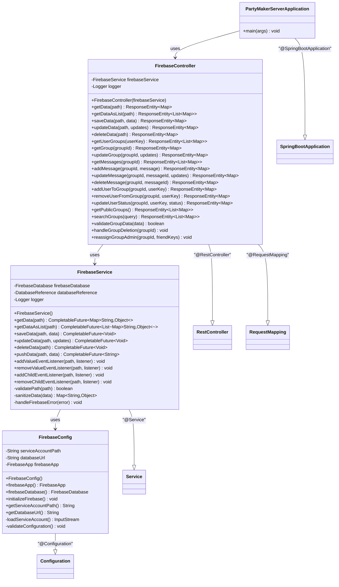

# PartyMaker - Spring Boot Server UML Diagram

## 🖥️ RESTful API Server Architecture

This diagram shows the Spring Boot server architecture with Firebase integration for the PartyMaker application.

---

## 🏗️ Server Class Diagram

---

## 📋 **Component Descriptions**

### **🎯 Core Components**

- **PartyMakerServerApplication**: Main Spring Boot application class with auto-configuration
- **FirebaseController**: REST controller handling all HTTP endpoints for Firebase operations
- **FirebaseService**: Business logic layer for Firebase Realtime Database operations
- **FirebaseConfig**: Configuration class for Firebase initialization and setup

---

## 🔗 **API Endpoints**

### **📊 Data Operations**
- `GET /firebase/data/{path}` - Retrieve data from Firebase path
- `GET /firebase/data-list/{path}` - Retrieve data as list from Firebase path
- `POST /firebase/data/{path}` - Save data to Firebase path
- `PUT /firebase/data/{path}` - Update data at Firebase path
- `DELETE /firebase/data/{path}` - Delete data from Firebase path

### **👥 Group Management**
- `GET /firebase/groups/user/{userKey}` - Get user's groups
- `GET /firebase/groups/{groupId}` - Get specific group
- `PUT /firebase/groups/{groupId}` - Update group (includes auto-deletion and admin reassignment)
- `GET /firebase/groups/public` - Get public groups
- `GET /firebase/groups/search?query={query}` - Search groups

### **💬 Chat Operations**
- `GET /firebase/groups/{groupId}/messages` - Get group messages
- `POST /firebase/groups/{groupId}/messages` - Add new message
- `PUT /firebase/groups/{groupId}/messages/{messageId}` - Update message
- `DELETE /firebase/groups/{groupId}/messages/{messageId}` - Delete message

### **👤 Member Management**
- `POST /firebase/groups/{groupId}/members/{userKey}` - Add user to group
- `DELETE /firebase/groups/{groupId}/members/{userKey}` - Remove user from group
- `PUT /firebase/groups/{groupId}/members/{userKey}/status` - Update user status

---

## ⚙️ **Key Features**

### **🔄 Auto Group Management**
- **Auto-deletion**: Groups are automatically deleted when the last member leaves
- **Admin reassignment**: When an admin leaves but other members remain, admin is reassigned to the first available member
- **Data validation**: All group operations include data validation and sanitization

### **🚀 Asynchronous Operations**
- All Firebase operations use `CompletableFuture` for non-blocking async processing
- Thread-safe database operations with proper error handling
- Efficient batch operations for multiple data updates

### **🔧 Configuration Management**
- Environment-based Firebase configuration
- Secure service account management
- Database URL validation and connection testing

---

*This server provides a lightweight, efficient REST API layer over Firebase Realtime Database with automatic group lifecycle management.* 