# PartyMaker - ViewModels & MVVM Architecture UML Diagram

## 🏛️ ViewModel Classes & MVVM Pattern

This UML diagram shows all ViewModel classes in the PartyMaker application and their MVVM architecture implementation.

---

## 🏗️ ViewModels Class Diagram

```mermaid
classDiagram
    %% Base ViewModel
    class BaseViewModel {
        #Application application
        #MutableLiveData~Boolean~ isLoading
        #MutableLiveData~String~ errorMessage
        #MutableLiveData~String~ successMessage
        #CompositeDisposable compositeDisposable
        
        +BaseViewModel(application)
        +getIsLoading() LiveData~Boolean~
        +getErrorMessage() LiveData~String~
        +getSuccessMessage() LiveData~String~
        #setLoading(loading) void
        #setError(error) void
        #setSuccess(message) void
        #clearMessages() void
        #onCleared() void
        +addDisposable(disposable) void
    }
    
    %% Core ViewModels
    class SplashViewModel {
        -AuthenticationManager authManager
        -MutableLiveData~Boolean~ isAuthenticated
        -MutableLiveData~String~ nextScreen
        
        +SplashViewModel(application)
        +getIsAuthenticated() LiveData~Boolean~
        +getNextScreen() LiveData~String~
        +checkAuthenticationState() void
        +initializeApplication() void
        -determineNextScreen() void
    }
    
    class MainActivityViewModel {
        -GroupRepository groupRepository
        -UserRepository userRepository
        -MutableLiveData~List~Group~~ userGroups
        -MutableLiveData~Boolean~ isRefreshing
        -MutableLiveData~User~ currentUser
        
        +MainActivityViewModel(application)
        +getUserGroups() LiveData~List~Group~~
        +getIsRefreshing() LiveData~Boolean~
        +getCurrentUser() LiveData~User~
        +loadUserGroups() void
        +refreshGroups() void
        +setServerUrl(url) void
        -handleGroupsLoadSuccess(groups) void
        -handleGroupsLoadError(error) void
    }
    
    %% Authentication ViewModels
    class AuthViewModel {
        -AuthenticationManager authManager
        -SecureAuthenticationManager secureAuthManager
        -MutableLiveData~Boolean~ isAuthenticated
        -MutableLiveData~User~ currentUser
        -MutableLiveData~String~ authError
        
        +AuthViewModel(application)
        +getIsAuthenticated() LiveData~Boolean~
        +getCurrentUser() LiveData~User~
        +getAuthError() LiveData~String~
        +signOut() void
        +getCurrentUserInfo() void
        #handleAuthSuccess(user) void
        #handleAuthError(error) void
    }
    
    class LoginViewModel {
        -PasswordValidator passwordValidator
        -MutableLiveData~Boolean~ isLoginSuccessful
        -MutableLiveData~String~ emailError
        -MutableLiveData~String~ passwordError
        
        +LoginViewModel(application)
        +getIsLoginSuccessful() LiveData~Boolean~
        +getEmailError() LiveData~String~
        +getPasswordError() LiveData~String~
        +signInWithEmail(email, password) void
        +signInWithGoogle(credential) void
        +validateEmail(email) boolean
        +validatePassword(password) boolean
        -performEmailLogin(email, password) void
        -performGoogleLogin(credential) void
    }
    
    class RegisterViewModel {
        -PasswordValidator passwordValidator
        -UserRepository userRepository
        -MutableLiveData~Boolean~ isRegistrationSuccessful
        -MutableLiveData~Map~String,String~~ fieldErrors
        
        +RegisterViewModel(application)
        +getIsRegistrationSuccessful() LiveData~Boolean~
        +getFieldErrors() LiveData~Map~String,String~~
        +registerUser(username, email, password, confirmPassword) void
        +validateAllFields(username, email, password, confirmPassword) ValidationResult
        -createUserAccount(userData) void
        -saveUserToDatabase(user) void
    }
    
    class ResetPasswordViewModel {
        -MutableLiveData~Boolean~ isResetSent
        -MutableLiveData~String~ emailError
        
        +ResetPasswordViewModel(application)
        +getIsResetSent() LiveData~Boolean~
        +getEmailError() LiveData~String~
        +sendPasswordReset(email) void
        +validateEmail(email) boolean
    }
    
    class IntroViewModel {
        -MutableLiveData~Boolean~ isIntroCompleted
        
        +IntroViewModel(application)
        +getIsIntroCompleted() LiveData~Boolean~
        +completeIntro() void
        +skipIntro() void
    }
    
    %% Group ViewModels
    class GroupViewModel {
        -GroupRepository groupRepository
        -MutableLiveData~Group~ selectedGroup
        -MutableLiveData~List~Group~~ allGroups
        
        +GroupViewModel(application)
        +getSelectedGroup() LiveData~Group~
        +getAllGroups() LiveData~List~Group~~
        +loadGroup(groupKey) void
        +updateGroup(group) void
        +deleteGroup(groupKey) void
    }
    
    class PartyMainViewModel {
        -GroupRepository groupRepository
        -UserRepository userRepository
        -MutableLiveData~Group~ currentGroup
        -MutableLiveData~Boolean~ isAdmin
        -MutableLiveData~Boolean~ isUserComing
        -MutableLiveData~List~User~~ members
        -MutableLiveData~List~User~~ comingMembers
        
        +PartyMainViewModel(application)
        +getCurrentGroup() LiveData~Group~
        +getIsAdmin() LiveData~Boolean~
        +getIsUserComing() LiveData~Boolean~
        +getMembers() LiveData~List~User~~
        +getComingMembers() LiveData~List~User~~
        +loadGroupDetails(groupKey) void
        +updateAttendanceStatus(groupKey, userKey, status) void
        +checkAdminStatus(groupKey, userKey) void
        +leaveGroup(groupKey, userKey) void
        -refreshGroupData() void
    }
    
    class GroupCreationViewModel {
        -GroupRepository groupRepository
        -MutableLiveData~Boolean~ isGroupCreated
        -MutableLiveData~String~ groupKey
        -MutableLiveData~Map~String,String~~ validationErrors
        
        +GroupCreationViewModel(application)
        +getIsGroupCreated() LiveData~Boolean~
        +getGroupKey() LiveData~String~
        +getValidationErrors() LiveData~Map~String,String~~
        +createGroup(groupData) void
        +validateGroupData(groupData) ValidationResult
        +uploadGroupImage(imageUri) void
        -generateGroupKey() String
        -saveGroupToDatabase(group) void
    }
    
    class GroupManagementViewModel {
        -GroupRepository groupRepository
        -MutableLiveData~Boolean~ isOperationSuccessful
        -MutableLiveData~Group~ managedGroup
        
        +GroupManagementViewModel(application)
        +getIsOperationSuccessful() LiveData~Boolean~
        +getManagedGroup() LiveData~Group~
        +updateGroupSettings(groupKey, settings) void
        +deleteGroup(groupKey) void
        +transferAdminRights(groupKey, newAdminKey) void
        +updateGroupPrivacy(groupKey, isPrivate) void
        +updateGroupPermissions(groupKey, canAdd) void
    }
    
    class GroupDiscoveryViewModel {
        -GroupRepository groupRepository
        -MutableLiveData~List~Group~~ publicGroups
        -MutableLiveData~List~Group~~ filteredGroups
        -MutableLiveData~Boolean~ isJoinSuccessful
        
        +GroupDiscoveryViewModel(application)
        +getPublicGroups() LiveData~List~Group~~
        +getFilteredGroups() LiveData~List~Group~~
        +getIsJoinSuccessful() LiveData~Boolean~
        +loadPublicGroups() void
        +filterGroups(query) void
        +joinGroup(groupKey, userKey) void
        +refreshPublicGroups() void
    }
    
    class DateManagementViewModel {
        -GroupRepository groupRepository
        -MutableLiveData~Boolean~ isDateUpdated
        -MutableLiveData~String~ dateError
        
        +DateManagementViewModel(application)
        +getIsDateUpdated() LiveData~Boolean~
        +getDateError() LiveData~String~
        +updateGroupDateTime(groupKey, date, time) void
        +validateDateTime(date, time) ValidationResult
        -formatDateTime(date, time) String
    }
    
    class MembersViewModel {
        -GroupRepository groupRepository
        -UserRepository userRepository
        -MutableLiveData~List~User~~ invitedMembers
        -MutableLiveData~List~User~~ comingMembers
        -MutableLiveData~Boolean~ isMemberAdded
        -MutableLiveData~Boolean~ isMemberRemoved
        
        +MembersViewModel(application)
        +getInvitedMembers() LiveData~List~User~~
        +getComingMembers() LiveData~List~User~~
        +getIsMemberAdded() LiveData~Boolean~
        +getIsMemberRemoved() LiveData~Boolean~
        +loadInvitedMembers(groupKey) void
        +loadComingMembers(groupKey) void
        +addMember(groupKey, email, isComing) void
        +removeMember(groupKey, userKey) void
        +updateMemberStatus(groupKey, userKey, isComing) void
    }
    
    class GroupChatViewModel {
        -GroupRepository groupRepository
        -MutableLiveData~List~ChatMessage~~ messages
        -MutableLiveData~Boolean~ isMessageSent
        
        +GroupChatViewModel(application)
        +getMessages() LiveData~List~ChatMessage~~
        +getIsMessageSent() LiveData~Boolean~
        +loadMessages(groupKey) void
        +sendMessage(groupKey, message) void
        +refreshMessages(groupKey) void
    }
    
    %% Feature ViewModels
    class GptViewModel {
        -OpenAIApiClient apiClient
        -MutableLiveData~List~ChatMessageGpt~~ conversation
        -MutableLiveData~Boolean~ isResponseLoading
        
        +GptViewModel(application)
        +getConversation() LiveData~List~ChatMessageGpt~~
        +getIsResponseLoading() LiveData~Boolean~
        +sendMessage(message) void
        +loadConversation() void
        +clearConversation() void
        -handleGptResponse(response) void
    }
    
    class ProfileViewModel {
        -UserRepository userRepository
        -MutableLiveData~User~ currentUser
        -MutableLiveData~Boolean~ isProfileUpdated
        -MutableLiveData~String~ imageUploadStatus
        
        +ProfileViewModel()
        +getCurrentUser() LiveData~User~
        +getIsProfileUpdated() LiveData~Boolean~
        +getImageUploadStatus() LiveData~String~
        +loadCurrentUser() void
        +updateProfile(userData) void
        +uploadProfileImage(imageUri) void
        +validateProfileData(userData) ValidationResult
    }
    
    class ServerSettingsViewModel {
        -MutableLiveData~String~ serverUrl
        -MutableLiveData~Boolean~ isServerModeEnabled
        -MutableLiveData~Boolean~ isSettingsSaved
        
        +ServerSettingsViewModel(application)
        +getServerUrl() LiveData~String~
        +getIsServerModeEnabled() LiveData~Boolean~
        +getIsSettingsSaved() LiveData~Boolean~
        +saveServerSettings(url, enabled) void
        +validateServerUrl(url) boolean
        +testServerConnection(url) void
    }
    
    class SecurityScanViewModel {
        -SecurityAgent securityAgent
        -MutableLiveData~List~SecurityResult~~ scanResults
        -MutableLiveData~Boolean~ isScanRunning
        -MutableLiveData~Float~ scanProgress
        
        +SecurityScanViewModel(application)
        +getScanResults() LiveData~List~SecurityResult~~
        +getIsScanRunning() LiveData~Boolean~
        +getScanProgress() LiveData~Float~
        +startSecurityScan() void
        +stopSecurityScan() void
        -performSecurityChecks() void
        -generateSecurityReport() void
    }

    %% Inheritance relationships
    SplashViewModel --|> BaseViewModel
    MainActivityViewModel --|> BaseViewModel
    AuthViewModel --|> BaseViewModel
    LoginViewModel --|> AuthViewModel
    RegisterViewModel --|> AuthViewModel
    ResetPasswordViewModel --|> AuthViewModel
    IntroViewModel --|> BaseViewModel
    GroupViewModel --|> BaseViewModel
    PartyMainViewModel --|> BaseViewModel
    GroupCreationViewModel --|> BaseViewModel
    GroupManagementViewModel --|> BaseViewModel
    GroupDiscoveryViewModel --|> BaseViewModel
    DateManagementViewModel --|> BaseViewModel
    MembersViewModel --|> BaseViewModel
    GroupChatViewModel --|> BaseViewModel
    GptViewModel --|> BaseViewModel
    ProfileViewModel --|> ViewModel
    ServerSettingsViewModel --|> BaseViewModel
    SecurityScanViewModel --|> BaseViewModel
    
    %% Composition relationships
    BaseViewModel o-- CompositeDisposable
    BaseViewModel o-- MutableLiveData
    
    %% Repository dependencies
    MainActivityViewModel --> GroupRepository : uses
    MainActivityViewModel --> UserRepository : uses
    AuthViewModel --> AuthenticationManager : uses
    LoginViewModel --> PasswordValidator : uses
    RegisterViewModel --> UserRepository : uses
    PartyMainViewModel --> GroupRepository : uses
    PartyMainViewModel --> UserRepository : uses
    GroupCreationViewModel --> GroupRepository : uses
    GroupManagementViewModel --> GroupRepository : uses
    GroupDiscoveryViewModel --> GroupRepository : uses
    DateManagementViewModel --> GroupRepository : uses
    MembersViewModel --> GroupRepository : uses
    MembersViewModel --> UserRepository : uses
    GroupChatViewModel --> GroupRepository : uses
    GptViewModel --> OpenAIApiClient : uses
    ProfileViewModel --> UserRepository : uses
    SecurityScanViewModel --> SecurityAgent : uses
```



---

## 🔍 ViewModel Architecture Patterns

### **🏛️ Base ViewModel Pattern:**
- **BaseViewModel**: Abstract base class providing common functionality
- **Shared Features**: Loading states, error handling, success messages
- **Resource Management**: CompositeDisposable for RxJava subscriptions
- **Lifecycle Awareness**: Automatic cleanup in onCleared()

### **🔐 Authentication ViewModels:**
- **AuthViewModel**: Base authentication functionality
- **LoginViewModel**: Email/password and Google Sign-In handling
- **RegisterViewModel**: User registration with validation
- **ResetPasswordViewModel**: Password recovery functionality
- **IntroViewModel**: Onboarding completion tracking

### **🎉 Group Management ViewModels:**
- **GroupViewModel**: Basic group operations
- **PartyMainViewModel**: Comprehensive group dashboard logic
- **GroupCreationViewModel**: Multi-step group creation process
- **GroupManagementViewModel**: Administrative operations
- **GroupDiscoveryViewModel**: Public group browsing and joining
- **DateManagementViewModel**: Date/time modification handling
- **MembersViewModel**: Member invitation and management

### **💬 Communication ViewModels:**
- **GroupChatViewModel**: Group messaging functionality
- **GptViewModel**: AI assistant integration with OpenAI

### **⚙️ Feature ViewModels:**
- **ProfileViewModel**: User profile management
- **ServerSettingsViewModel**: Server configuration
- **SecurityScanViewModel**: Security monitoring and scanning

---

## 📊 MVVM Implementation Details

### **LiveData Usage:**
- **Reactive UI**: All ViewModels expose LiveData for UI observation
- **State Management**: Loading, error, and success states
- **Data Binding**: Two-way data binding support
- **Lifecycle Awareness**: Automatic UI updates and cleanup

### **Repository Integration:**
- **Separation of Concerns**: ViewModels delegate data operations to repositories
- **Single Source of Truth**: Repositories provide centralized data access
- **Caching Strategy**: ViewModels coordinate local and remote data
- **Error Propagation**: Repository errors bubble up through ViewModels

### **Validation Framework:**
- **Real-time Validation**: Immediate feedback during user input
- **Field-level Errors**: Specific validation messages per field
- **Business Rules**: Complex validation logic in ViewModels
- **User Experience**: Non-blocking validation with clear feedback

---

## 🔄 Data Flow Patterns

### **Unidirectional Data Flow:**
```
Repository → ViewModel → LiveData → UI
     ↑                                ↓
User Actions ← Activity/Fragment ←─────┘
```

---

## 📋 **ViewModel Summary**

### **🏗️ Architecture**
- **BaseViewModel**: Common base class with shared functionality
- **ProfileViewModel**: Extends ViewModel directly for profile management
- **Repository Integration**: All ViewModels use Repository pattern for data access
- **LiveData**: Reactive UI updates through LiveData observers

### **🎯 Core Features**
- **State Management**: Loading, error, and success states
- **Data Binding**: Two-way data binding with UI components
- **Lifecycle Awareness**: Automatic cleanup and memory management
- **Error Handling**: Consistent error propagation and user feedback

---

*19 ViewModels providing MVVM presentation logic for all major app features with proper lifecycle management and reactive data binding.* 